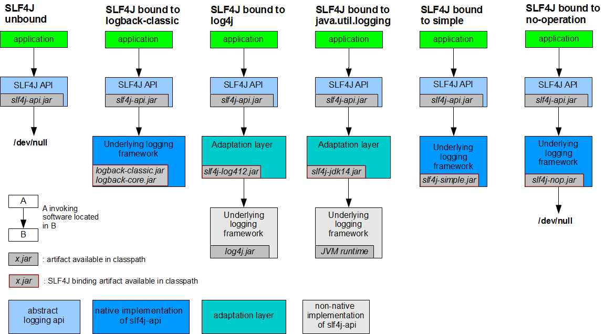

# 教程地址  
[教程地址](https://www.bilibili.com/video/BV1Et411Y7tQ?p=1)
# Spring Boot入门  
## 简介  
> 简化Spring应用开发的一个框架；    

>整个Spring技术栈的一个大整合；  

>J2EE开发的一站式解决方案；  

## 微服务  
- 是一个架构风格（服务微化）  

- 一个应用应该是一组小型服务；可以通过HTTP的方式进行互通；  

- 每一个功能元素最终都是一个可独立替换和独立升级的软件单元；  

## Maven设置  
- 给maven的settings.xml配置文件的profiles标签添加默认使用的jdk版本：  
```xml
<profile>
  <id>jdk‐1.8</id>
  <activation>
    <activeByDefault>true</activeByDefault>
    <jdk>1.8</jdk>
  </activation>
  <properties>
    <maven.compiler.source>1.8</maven.compiler.source>
    <maven.compiler.target>1.8</maven.compiler.target>
    <maven.compiler.compilerVersion>1.8</maven.compiler.compilerVersion>
  </properties>
</profile>
```  
- 将maven整合到IDEA中(IDEA Setting--Maven设置maven的跟路径、`setting.xml`位置和仓库地址)  

## Spring Boot自动配置  
Spring Boot在启动的时候从类路径下的`META-INF/spring.factories`中获取EnableAutoConfiguration指定的值，将这些值作为自动配置类导入到容器中，自动配置类就生效，帮我们进行自动配置工作；以前我们需要自己配置的东西，自动配置类都帮我们；  

J2EE的整体整合解决方案和自动配置都在spring-boot-autoconfigure-1.5.9.RELEASE.jar；

# Spring Boot配置     
##  配置文件  
- Spring Boot使用一个全局配置文件，支持两种格式。（可以在这修改自动配置默认值）  
  - `application.properties`  

  - `application.yml`    
- 配置文件存放在`src/main/resources`目录或者`类路径/config`下  

- yml是YAML（YAML Ain`t Markup Language）语言的文件，**以数据为中心**，比json、xml更适合做配置文件。  
yml文件：    
  ```yml
  server:  
    port: 8081
  ```   
  xml文件： 
  ```xml
  <server>
    <port>8081</port>
  </server> 
  ```   
## YAML语法  
### 1. YAML基本语法  
  - 使用**缩进**表示层级关系。  

  - 缩进时不允许使用Tab键，只允许使用空格。  
  - 缩进的空格数目不重要，只要相同层级的元素**左对齐**即可。  
  - 大小写敏感。  

### 2. YAML支持的三种数据结构     
- 对象：键值对的集合   
  - 通过K: V的形式表达（**：后面必须得加空格**）  
  - 第一行只写对象名 在下一行写对象属性和值的关系 注意缩进
    ```yml
    student:  
      name: fish  
      age: 23
    ```       
  - 支持行内写法  
    ```yml
    student: {name: fish,age: 23}
    ```  

- 数组：一组按次序排列的值   
  - 用`-  值`表示数组中的一个元素  
     ```yml
      age:  
        - 12  
        - 14  
        - 23
      ```    
  - 支持行内写法  
      ```yml
      age: [12,14,23]
      ```        

- 字面量：单个的、不可再分的值（数字、字符串、布尔）   
  - 通过K: V的形式表达（：后面必须得加空格） 

  - 字符串默认不用加上单引号或者双引号  

  - "" 双引号：不会转义字符串里的特殊字符   name: "aa\nlist" 输出 aa换行list  

  - '' 单引号：会转义特殊字符 特殊字符最终只是一个普通的字符串数据   name: "aa\nlist" 输出 aa\nlist   

  ```yml
  name: fish
  ```   

### 3. 配置文件注入  
yml配置文件：  
```yml
person:
    name: fish
    age: 23
    boss: false
    birth: 2018/11/11
    maps: {k1: v1,k2,v2}
    lists:
      - 12
      - 32
      - 45
    dog:
      name: tom
      age: 23
```   
JavaBean：  
```java
/**
 * 通过 @ConfigurationProperties 注解将配置文件中属性的值映射到这个组件中
 * @ConfigurationProperties : 告诉Spring Boot将本类中所有属性和配置文件中相关的配置进行绑定。
 * prefix : 指定配置文件中的哪个对象下面的属性进行一一映射。
 *
 * 只有这个组件是容器中的组件，才能使用容器提供的@ConfigurationProperties功能。
 * 所以必须先使用类注解将当前组件加入到容器中。
 * */
@Component
@ConfigurationProperties(prefix = "person")
public class Person {
    private String name;;
    private Integer age;
    private Boolean boss;
    private Date birth;

    private Map<String,Object> maps;
    private List<Object> lists;
    private Dog dog;  
    //省略了get、set方法  
}  

public class Dog {
    private String name;
    private String age;
}
```  
项目首次使用` @ConfigurationProperties`注解需要先添加相关依赖：  
```xml  
<dependency>
    <groupId>org.springframework.boot</groupId>
    <artifactId>spring-boot-configuration-processor</artifactId>
    <optional>true</optional>
</dependency>
```  
通过属性文件也可以实现注入: 
```properties 
# idea默认使用的是utf-8，而properties文件用的assc编码需要在File--Setting--搜索file encoding 将转成assc码选上
# 配置person的值
person.name=fish
person.age=23
person.birth=2020/12/21
person.boss=false
person.maps.k1=v1
person.maps.k2=v4
person.lists=[12,34,45]
person.dog.name=tom
person.dog.age=12
```  
## @Value和@ConfigurationProperties注解的区别   
描述| @ConfigurationProperties | @Value  
:-|:-|:-  
功能|批量注入配置文件中的属性(作用在类上) | 一个个指定(作用在属性上)   
松散绑定(松散语法)|支持|不支持  
SpEL(Spirng表达式)|不支持|支持  
JSR30数据校验|支持|不支持  
复杂类型封装|支持|不支持    
- 如果我们只是在某个业务逻辑中需要获取一下配置文件中的某项值（单个属性值），使用@Value注解。  

- 如果我们专门编写了一个JavaBean来和配置文件进行映射（对象所有属性值），使用@ConfigurationProperties注解。    

- 松散绑定：使用`@ConfigurationProperties`注解，配置文件中`last-name`和`lastName`最终都可以被识别并表示的是同一个属性。  

- 数据校验`@Validated`：  
```java  
@Component
@ConfigurationProperties(prefix = "person")  
@Validated //JSR30数据校验注解 表示当前类需要进行校验 可在属性上配置具体的校验规则
public class Person {
    //@Value("${person.name}")  //获取配置文件中的值  
    @Email                      //name必须是邮箱类型 @Value不支持
    private String name;;  
    //@Value("#{12*2}")         //获取表达式中的值 只有@Value支持
    private Integer age;
    //@Value("true")
    private Boolean boss;
    private Date birth;

    private Map<String,Object> maps;
    private List<Object> lists;
    private Dog dog;    

}  
```
## @PropertySource和@ImportResource  
### @PropertySource
- @PropertySource**只能用于properties文件**,用来加载指定的配置文件。   

- @ConfigurationProperties(prefix = "person")默认从全局配置文件(application.properties)中获取值。如果不是全局文件需要使用@PropertySource注解。  

- @PropertySource格式：  
  ```java  
  @PropertySource(value={"classpath:person.properties"})
  public class Person {}
  ```
### @ImportResource
- @ImportResource用来读取外部配置文件。（导入Spring配置文件`bean.xml`，让配置文件里的内容生效。不推荐使用）    

- Spring Boot里面没有Spring的配置文件，我们自己编写的配置文件，也不能自动识别，想让Spring的配置文件生效，加载进来需要使用@ImportResource注解。  

- @ImportResource注解一般标注在主配置类上。  
  ```java  
  @ImportResource(locations={"classpath:bean.xml"})
  @SpringBootApplication  
  public class SpringBootConfigApplication {
      public static void main(String[] args){
          SpringBootApplication.run(...);
      }
  }
  ```
- Spring Boot推荐使用**配置类**的方式给容器中添加组件，而不是导入Spring配置文件的形式：  
```java
@Configuration  //指明当前类是一个配置类，用来代替Spring配置文件  
public class MyAppConfig{
  @Bean  //将方法的返回值添加到容器中，容器中这个组件的默认id为方法名
  public HelloService helloService(){
    return new HelloService();
  }
}
```   
## 配置文件占位符  
- 随机数    
```properties  
${random.value}  ${random.int}  ${random.long}  
${random.int(10)}  ${random.int[1024,65536]}  
person.age=${random.int}
```

- 占位符获取之前配置的值，如果没有可以使用 : 指定默认值。
```properties  
person.name=fish 
#之前没声明过dept属性，如果不设默认值，person.dept会当做字符串显示。
person.dog.name=${person.dept:model}_dog
```
## Profile  
Profile是Spring对不同环境提供不同配置功能的支持，可以通过激活、指定参数等方式**快速切换环境**（开发、测试、应用）。    

### 1. 多Profile文件(比较麻烦 不推荐)     
- 我们在主配置文件编写的时候，文件名可以是`application-{profile}.properties/yml`。  

  - 开发环境：`application-dev.properties/yml`  

  - 测试环境：`application-test.properties/yml`   

  - 生产环境：`application-prod.properties/yml`   

- 默认使用的是`application.properties/yml`。

### 2. yml支持多文档块方式  
- yml使用` --- `来隔离多个文档块  

- 如果有多个环境推荐最好使用这种方式   
```yml
#默认端口
server:  
  port: 8081    
#通过active属性可以指定其它文档块的端口
spring:   
  profiles:  
    active: dev  

---
#开发环境的端口  
server:  
  port: 8082  
spring: 
  profiles: dev 

---
#生产环境的端口  
server:  
  port: 8083  
spring: 
  profiles: prod
```

### 3. 激活指定profile 
- 在配置文件`application.properties/yml`中指定需要激活的环境：  
```properties  
#通过激活属性active指定具体的环境
spring.profiles.active=dev
```  
- 以命令行的形式激活指定环境：  
  - 打成jar包后修改：`java -jar projectname-0.0.1-SNAPSHOT.jar -- spring.profiles.active=dev;`  

  - 以Program arguments的形式激活：将参数设置为`-- spring.profiles.active=dev`

- 虚拟机参数形式：和Program arguments在同一个地方，将VIM options设置为`-Dspring.profiles.active=dev`  

## 配置文件加载位置  
- 默认的主配置文件放在`src/main/resources`目录下(等同于`classpath:/`)  

- spring boot启动会扫描以为位置的application.properties/yml文件作为Spring的默认配置文件  
  - file:./config/    

  - file:./ (当前项目的的第一层子目录 和src同级)  
  - classpath:/config/  
  - classpath:/(src/main/resources)  

- 以上是按照优先级从高到低的顺序，所有位置的文件都会被加载，**高优先级配置内容会覆盖低优先级配置内容**。  

- 我们也可以通过配置`spring.config.location`来改变默认值(运维时非常方便)    
  - 只能在打包之后通过命令行的方式执行  

  - 可以和原来的配置形成互补配置  

  - 配置方式：`java -jar projectname-0.0.1-SNAPSHOT.jar -- spring.config.location=F:/application.properties;`

## 外部配置加载顺序  
SpringBoot也可以从以下位置加载配置；**优先级从高到低**；高优先级配置覆盖低优先级配置，所有配置会形成互补配置：  
1. **命令行参数**    
  - 所有的配置都可以在命令行上进行指定：`java -jar project-0.0.1-SNAPSHOT.jar --server.port=8087 --server.context-path=/abc`    

  - 多个配置用空格分开，配置格式为：` --配置项=值`

2. 来自java:comp/env的JNDI属性   

3. Java系统属性（System.getProperties()）
4. 操作系统环境变量  
5. RandomValuePropertySource配置的random.*属性值   

**由jar包外向jar包内进行寻找；优先加载带profile;**  

6. jar包外部的application-{profile}.properties或application.yml(带spring.profile)配置文件  

7. jar包内部的application-{profile}.properties或application.yml(带spring.profile)配置文件

**再来加载不带profile**  

8. jar包外部的application.properties或application.yml(不带spring.profile)配置文件  

9. jar包内部的application.properties或application.yml(不带spring.profile)配置文件  

10. @Configuration注解类上的@PropertySource 

11. 通过SpringApplication.setDefaultProperties指定的默认属性   

所有支持的配置加载来源：[参考官方文档](https://docs.spring.io/spring-boot/docs/1.5.9.RELEASE/reference/htmlsingle/#boot-features-external-config)  

## 自动配置原理  
[配置文件能配置的属性参照](https://docs.spring.io/spring-boot/docs/1.5.9.RELEASE/reference/htmlsingle/#common-application-properties)    

### 自动配置原理（重要）   
- SpringBoot启动的时候加载主配置类，开启了自动配置功能 **@EnableAutoConfiguration**。   
  
- **@EnableAutoConfiguration**的作用：    
  - 利用EnableAutoConfigurationImportSelector给容器中导入一些组件  

  - 可以查看selectImports()方法的内容  

  - List<String> configurations = getCandidateConfigurations  (annotationMetadata, attributes);获取候选的配置  
    ```java  
    //扫描所有jar包类路径下  META-INF/spring.factories
    //把扫描到的这些文件的内容包装成properties对象  
    //从properties中获取到EnableAutoConfiguration.class类（类名）对应的值，然后把他们添加在容器中   
    //每一个这样的 xxxAutoConfiguration类都是容器中的一个组件，都加入到容器中；用他们来做自动配置； 
    SpringFactoriesLoader.loadFactoryNames();  
    ```
    
- 每一个自动配置类进行自动配置功能；   

- 以**HttpEncodingAutoConfiguration（Http编码自动配置）** 为例解释自动配置原理；  
```java
@Configuration   //表示这是一个配置类，以前编写的配置文件一样，也可以给容器中添加组件。
@EnableConfigurationProperties(HttpEncodingProperties.class)  //启动指定类的ConfigurationProperties功能；将配置文件中对应的值和HttpEncodingProperties绑定起来；并把HttpEncodingProperties加入到ioc容器中。
 
@ConditionalOnWebApplication //Spring底层@Conditional注解（Spring注解版），根据不同的条件，如果满足指定的条件，整个配置类里面的配置就会生效；这里是判断当前应用是否是web应用，如果是，当前配置类生效。
 
@ConditionalOnClass(CharacterEncodingFilter.class)  //判断当前项目有没有这个类CharacterEncodingFilter；SpringMVC中进行乱码解决的过滤器；
 
@ConditionalOnProperty(prefix = "spring.http.encoding", value = "enabled", matchIfMissing = true)  //判断配置文件中是否存在某个配置  spring.http.encoding.enabled；如果不存在，判断也是成立的。
//即使我们配置文件中不配置pring.http.encoding.enabled=true，也是默认生效的；  

public class HttpEncodingAutoConfiguration {
    //他已经和SpringBoot的配置文件映射了   
    private final HttpEncodingProperties properties;   
    //只有一个有参构造器的情况下，参数的值就会从容器中拿
    public HttpEncodingAutoConfiguration(HttpEncodingProperties properties{ 
        this.properties = properties;        
    }    
   
    @Bean   //给容器中添加一个组件，这个组件的某些值需要从properties中获取
    @ConditionalOnMissingBean(CharacterEncodingFilter.class) //判断容器没有这个组件？    
    public CharacterEncodingFilter characterEncodingFilter() {    
    CharacterEncodingFilter filter = new OrderedCharacterEncodingFilter();        
    filter.setEncoding(this.properties.getCharset().name());        
    filter.setForceRequestEncoding(this.properties.shouldForce(Type.REQUEST));        
    filter.setForceResponseEncoding(this.properties.shouldForce(Type.RESPONSE));        
    return filter;        
}    
// 根据当前不同的条件判断，决定这个配置类是否生效。   
// 一但这个配置类生效；这个配置类就会给容器中添加各种组件；这些组件的属性是从对应的properties类中获取的，这些类里面的每一个属性又是和配置文件绑定的；  
```

- 所有在配置文件中能配置的属性都是在xxxxProperties类中封装；配置文件能配置什么就可以参照某个功能对应的这个属性类。     

- 总结：  
  - SpringBoot启动会加载大量的自动配置类  

  - 我们看我们需要的功能有没有SpringBoot默认写好的自动配置类；  

  - 我们再来看这个自动配置类中到底配置了哪些组件；（只要我们要用的组件有，我们就不需要再来配置了）  

  - 给容器中自动配置类添加组件的时候，会从properties类中获取某些属性。我们就可以在配置文件中指定这些属性的值；  

  - xxxAutoConfigurartion：自动配置类；给容器中添加组件；  

  - xxxxProperties:封装配置文件中相关属性；

### 细节   
**@Conditional派生注解**   

作用：必须是@Conditional指定的条件成立，才给容器中添加组件，配置类里面的所有内容才生效；   
注解|作用 
:-|:-
@Conditional扩展注解 | 判断是否满足当前指定条件 
@ConditionalOnJava | 系统的java版本是否符合要求
@ConditionalOnBean | 容器中存在指定Bean；
@ConditionalOnMissingBean | 容器中不存在指定Bean；
@ConditionalOnExpression | 满足SpEL表达式指定
@ConditionalOnClass | 系统中有指定的类
@ConditionalOnMissingClass | 系统中没有指定的类
@ConditionalOnSingleCandidate | 容器中只有一个指定的Bean，或者这个Bean是首选Bean
@ConditionalOnProperty | 系统中指定的属性是否有指定的值
@ConditionalOnResource | 类路径下是否存在指定资源文件
@ConditionalOnWebApplication | 当前是web环境
@ConditionalOnNotWebApplication | 当前不是web环境
@ConditionalOnJndi | JNDI存在指定项  

自动配置类必须在一定的条件下才能生效；我们可以通过**启用 debug=true属性**；来让控制台打印自动配置报告，这样我们就可以很方便的知道哪些自动配置类生效；  

# Spring Boot与日志    
## 日志框架     
市面上的日志框架：  
日志门面（日志的抽象层）| 日志实现  
-|- 
~~JCL(Jakarta Commons Logging)~~  **SLF4j**(Simple Logging Facade for Java)  ~~jboss-logging~~ | Log4j  JUL(java.util.logging)  Log4j2 **Logback**   

- 左边选一个门面（抽象层）、右边来选一个实现；    

- **Spring Boot 使用的是 SLF4j + Logback** ；  

- Spring使用的是JCL日志门面，所以一般在导入spring相关依赖时首先就会将JCL排除。   

- SLF4j、Log4j和Logback是同一个人编写的  

## SLF4j使用   
以后开发的时候，日志记录方法的调用，不应该来直接调用日志的实现类，而是**调用日志抽象层里面的方法**；   

**1. 简单案例**   

给系统里面导入slf4j的jar和 logback的实现jar  
```java
import org.slf4j.Logger;
import org.slf4j.LoggerFactory;
 
public class HelloWorld {
  public static void main(String[] args) {
    Logger logger = LoggerFactory.getLogger(HelloWorld.class);
    logger.info("Hello World");
  }
}
```     
SLF4j支持的实现模式：  

  

每一个日志的实现框架都有自己的配置文件。使用slf4j以后，配置文件还是做成日志实现框架自己本身的配置文件；

**2. 存在的问题**    

如果我们在Spring Boot中集成了很多框架，而不同框架使用了不同类型的日志模式，如何进行统一？  

SLF4j给出了以下解决方案：    

    

- 将系统中其他日志框架先排除出去；  

- 用中间包来替换原有的日志框架；(实现是一样的 只是都改成使用SLF4j的接口)  

- 我们导入slf4j其他的实现
 
## Spring Boot日志间的关系      
- Spring Boot 使用`spring‐boot‐starter‐logging`启动器做日志功能   

- 底层依赖关系:    

     

- SpringBoot底层也是使用slf4j+logback的方式进行日志记录  

- SpringBoot通过中间替换包的形式把其他的日志都替换成了slf4j   

- 如果我们要引入其他框架 一定要把这个框架的默认日志依赖移除掉换成中间替换包   

例如Spring默认使用的是JCL日志框架，在添加Spring依赖时要做如下配置：  
```xml   
<dependency>   
  <groupId>org.springframework</groupId>       
  <artifactId>spring‐core</artifactId>       
  <exclusions>       
    <exclusion>           
    <groupId>commons‐logging</groupId>               
    <artifactId>commons‐logging</artifactId>               
    </exclusion>           
  </exclusions>       
</dependency>   
```
**SpringBoot能自动适配所有的日志，引入其他框架的时候，只需要把这个框架依赖的日志框架排除掉即可；**  

## 日志使用  
- SpringBoot默认帮我们配置好了日志，并使用info级别：  
```java
//记录器     
Logger logger = LoggerFactory.getLogger(getClass());   
    
@Test     
public void contextLoads() {     
//System.out.println();         
 
//日志的级别由低到高   trace<debug<info<warn<error         
//可以调整输出的日志级别；日志就只会在这个级别以以后的高级别生效         
logger.trace("这是trace日志...");         
logger.debug("这是debug日志...");         
//SpringBoot默认给我们使用的是info级别的，没有指定级别的就用SpringBoot默认规定的级别(root级别)       
logger.info("这是info日志...");         
logger.warn("这是warn日志...");         
logger.error("这是error日志...");         
}     
```
- 日志输出格式：  
```properties   
%d表示日期时间，       
%thread表示线程名，       
%‐5level：级别从左显示5个字符宽度       
%logger{50} 表示logger名字最长50个字符，否则按照句点分割。        
%msg：日志消息，       
%n是换行符    

%d{yyyy‐MM‐dd HH:mm:ss.SSS} [%thread] %‐5level %logger{50} ‐ %msg%n
```  
- SpringBoot修改日志的默认配置  
```properties
#将日志级别调至trace级别 即输出所有类型的日志 
logging.level.com.atguigu=trace
 
#logging.path=
# 不指定路径在当前项目下生成springboot.log日志
# 可以指定完整的路径；
#logging.file=G:/springboot.log
# 在当前磁盘的根路径下创建spring文件夹和里面的log文件夹；使用 spring.log 作为默认文件
logging.path=/spring/log
 
#  在控制台输出的日志的格式
logging.pattern.console=%d{yyyy‐MM‐dd} [%thread] %‐5level %logger{50} ‐ %msg%n
# 指定文件中日志输出的格式
logging.pattern.file=%d{yyyy‐MM‐dd} === [%thread] === %‐5level === %logger{50} ==== %msg%n
```
- `logging.file`和`logging.path`区别    

**logging.file**|**logging.path**|Description 
-|-|- 
(none)|(none)|只在控制台输出    
指定文件名|(none)|输出日志到指定文件中  
(none)|指定目录|输出日志到指定目录中  

**logging.file** 只支持输出到指定文件中，**logging.path** 只支持输出到指定目录中。

- 指定配置     

给类路径下(main资源文件夹下)放上每个日志框架自己的配置文件即可；SpringBoot就不使用他默认配置的了。 
Logging System | Customization  
-|-  
Logback|`logback-spring.xml`、`logback-spring.groovy`、`logback.xml`、`logback.groovy`  
Log4j2|`log4j2-spring.xml`、`log4j2.xml`  
JUL(Java Util Logging)|`logging.properties`  

logback.xml：直接就被日志框架识别了；  

logback-spring.xml：日志框架就不直接加载日志的配置项，由SpringBoot解析日志配置，可以使用SpringBoot的高级Profile功能。（需要手动配置才会生效）  

```xml
<springProfile name="staging">
    <!‐‐ configuration to be enabled when the "staging" profile is active ‐‐>
   可以指定某段配置只在某个环境下生效   
</springProfile>
```  
如：  
```xml
<appender name="stdout" class="ch.qos.logback.core.ConsoleAppender">
<!‐‐  
日志输出格式：
  %d表示日期时间，             
  %thread表示线程名，             
  %‐5level：级别从左显示5个字符宽度             
  %logger{50} 表示logger名字最长50个字符，否则按照句点分割。              
  %msg：日志消息，             
  %n是换行符             
‐‐>
  <layout class="ch.qos.logback.classic.PatternLayout">
    <!--指定开发版本使用的日志格式-->
    <springProfile name="dev">
      <pattern>%d{yyyy‐MM‐dd HH:mm:ss.SSS} ‐‐‐‐> [%thread] ‐‐‐> %‐5level 
%logger{50} ‐ %msg%n</pattern>
    </springProfile>
    <springProfile name="!dev">
      <pattern>%d{yyyy‐MM‐dd HH:mm:ss.SSS} ==== [%thread] ==== %‐5level 
%logger{50} ‐ %msg%n</pattern>
    </springProfile>
        </layout>
    </appender>
``` 
如果使用logback.xml作为日志配置文件(会自动加载 无需再配置)，还要使用profile功能，会有以下错误：    

`no applicable action for [springProfile]`    

## 切换日志框架  
可以按照slf4j的日志适配图，进行相关的切换；（不推荐）   

切换为log4j2：  
```xml
<dependency>
  <groupId>org.springframework.boot</groupId>
  <artifactId>spring‐boot‐starter‐web</artifactId>
  <!--1. 排除掉spring boot 默认的日志框架-->
  <exclusions>
    <exclusion>
      <groupId>org.springframework.boot</groupId>
      <artifactId>spring‐boot‐starter‐logging</artifactId>
    </exclusion>
  </exclusions>
</dependency>  

<!--2. 添加log4j2启动器--> 
<dependency>
  <groupId>org.springframework.boot</groupId>
  <artifactId>spring‐boot‐starter‐log4j2</artifactId>
</dependency>
```
# Spring Boot与Web开发  
## 简介    
- 创建SpringBoot应用，选中我们需要的模块；  

- SpringBoot已经默认将这些场景配置好了，只需要在配置文件中指定少量配置就可以运行起来。  
  
  - xxxAutoConfiguration ：帮我们给容器中配置组件   

  - xxxProperties ：配置类来封装配置文件的内容    

- 自己编写业务代码

## Spring Boot对静态资源的映射规则     
- 所有 `/webjars/**` ，都去 `classpath:/META-INF/resources/webjars/` 找资源；  
> webjars：以jar包的方式引入静态资源；<http://www.webjars.org/>    
  
我们可以直接通过webjars目录访问到相关资源：`localhost:8080/webjars/jquery/3.3.1/jquery.js`   
```xml
<!--引入jquery‐webjar在访问的时候只需要写webjars下面资源的名称即可-->
<dependency>         
  <groupId>org.webjars</groupId>             
  <artifactId>jquery</artifactId>             
  <version>3.3.1</version>             
</dependency>         
```

- `"/**"` 访问当前项目的任何资源，都去静态资源的文件夹找映射，Spring Boot默认会从以下目录寻找静态资源：  

  - `"classpath:/META‐INF/resources/"`  

  - `"classpath:/resources/"`
  - `"classpath:/static/"`
  - `"classpath:/public/" `
  - `"/"` ：当前项目的根路径(和pom.xml同级)  
  `localhost:8080/abc` === 去静态资源文件夹里面找abc  

- 欢迎页：静态资源文件夹下的所有`index.html`页面；被`"/**"`映射；  

- 所有的 `**/favicon.ico` 都是在静态资源文件下找；

## 模板引擎    
- 目前常用的模板引擎：`JSP`、`Velocity`、`Freemarker`、`Thymeleaf`   

- 工作原理：  
    

- Spring Boot推荐Thymeleaf；语法更简单，功能更强大。  

### 引入Thymeleaf  
```xml
<dependency>         
  <groupId>org.springframework.boot</groupId>             
  <artifactId>spring‐boot‐starter‐thymeleaf</artifactId>             
  <version>2.1.6</version>   
</dependency>         
<!--切换thymeleaf版本-->
<properties>
  <thymeleaf.version>3.0.9.RELEASE</thymeleaf.version>         
  <!--布局功能的支持程序  thymeleaf3主程序  layout2以上版本 版本必须使用推荐的配置规则-->       
  <!--thymeleaf2   layout1-->          
  <thymeleaf‐layout‐dialect.version>2.2.2</thymeleaf‐layout‐dialect.version>        
</properties>
```
### Thymeleaf使用  
只要我们把HTML页面放在`classpath:/templates/`，thymeleaf就能自动渲染；    

- 第一步：导入thymeleaf的名称空间   
```html
<html lang="en" xmlns:th="http://www.thymeleaf.org">
```  

- 第二步：使用thymeleaf语法  
```html
<!DOCTYPE html>
<html lang="en" xmlns:th="http://www.thymeleaf.org">
<head>
    <meta charset="UTF‐8">
    <title>Title</title>
</head>
<body>
    <h1>成功！</h1>
    <!‐‐th:text 将div里面的文本内容设置为 ‐‐>
    <div th:text="${hello}">这是显示欢迎信息</div>
</body>
</html>
```  
### Thymeleaf语法规则    
#### `th:任意html属性` ：替换原生属性的值    
> `th:text` ：改变当前元素里面的文本内容  
  

#### 表达式  
- `${...}`：获取变量的值（OGNL）  

  - 获取对象的属性、调用方法  

  - 使用内置的基本对象(`#request` `#session` `#locale` ...)  

  - 内置的一些工具对象(`#dates` `#calendars` `#strings` `#objects` `#lists` ...)  

- ` *{...}`：选择表达式，和${}在功能上是一样，只是多了一个获取对象属性的简便形式：  
```html  
<!--补充：配合 th:object="${session.user}：-->
<div th:object="${session.user}">
 <p>Name: <span th:text="*{firstName}">Sebastian</span>.</p>
 <p>Surname: <span th:text="*{lastName}">Pepper</span>.</p>
 <p>Nationality: <span th:text="*{nationality}">Saturn</span>.</p>
 </div>
```
- `#{...}`：获取国际化内容
- `@{...}`：定义URL (`@{/order/process(execId=${execId},execType='FAST')}`)  
- `~{...}`：片段引用表达式 (`<div th:insert="~{commons :: main}">...</div>`) 
- 字面量  
- 文本操作  
- 数学运算  
- 布尔运算  
- 比较运算  
- 条件运算（三元运算符）   
>  If‐then: (if) ? (then)  
   If‐then‐else: (if) ? (then) : (else)
   Default: (value) ?: (defaultvalue)
- ` _ `：不做任何操作

## SpringMVC自动配置   
### Spring MVC auto-configuration     
Spring Boot通过WebMvcAutoConfiguration自动配置好了Spring MVC ：    

- 自动配置了`ViewResolver`（视图解析器：根据方法的返回值得到视图对象（View），视图对象决定如何渲染（转发？重定向？））   

- 我们可以自己给容器中添加一个自己定制的视图解析器；Spring Boot会通过`ContentNegotiatingViewResolver`自动的将其组合进来；   

- 支持静态资源文件的导入(包括支持webjars)    

- 支持静态首页访问(index.html)  

- 支持自定义favicon.ico(网页图标)  

- 自动注册了`Converter`(转换器 将前端数据转换成entity)、`GenericConverter`、`Formatter`(格式化器 日期、数据等格式化)    
```java
@Bean         
@ConditionalOnProperty(prefix = "spring.mvc", name = "date‐format")//在文件中配置日期格式化的规则
        
public Formatter<Date> dateFormatter() {         
  //日期格式化组件
  return new DateFormatter(this.mvcProperties.getDateFormat());          
}       

//自己添加的格式化器转换器，我们只需要放在容器中即可。  
``` 
- 支持HttpMessageConverters     

  - HttpMessageConverter ：SpringMVC用来转换Http请求和响应的；User---Json；

  - HttpMessageConverters ：是从容器中确定；获取所有的HttpMessageConverter；   

  - 自己给容器中添加HttpMessageConverter，只需要将自己的组件注册容器中
（@Bean,@Component）   

- 自动注册`MessageCodesResolver`(定义错误代码生成规则)   

- 默认使用`ConfigurableWebBindingInitializer`  
我们可以配置一个`ConfigurableWebBindingInitializer`来替换默认的；（添加到容器）  

- web所有自动场景(`WebMvcConfigurerAdapter` `WebMvcRegistrationsAdapter` ...)  

### 扩展SpringMVC    
可以通过编写一个配置类（`@Configuration`），继承`WebMvcConfigurerAdapter`类；不能标注`@EnableWebMvc`;既保留了所有的自动配置，也能用我们扩展的配置:  
```java
//使用WebMvcConfigurerAdapter可以来扩展SpringMVC的功能
@Configuration
public class MyMvcConfig extends WebMvcConfigurerAdapter {
 
    @Override
    public void addViewControllers(ViewControllerRegistry registry) {
         // super.addViewControllers(registry);
        //浏览器发送 /atguigu 请求来到 success
        registry.addViewController("/atguigu").setViewName("success");
    }
}
```
**扩展原理：**    
- `WebMvcAutoConfiguration`是SpringMVC的自动配置类  

- 在做其他自动配置时会导入:`@Import(EnableWebMvcConfiguration.class)`
```java
@Configuration
public static class EnableWebMvcConfiguration extends DelegatingWebMvcConfiguration {  
   private final WebMvcConfigurerComposite configurers = new WebMvcConfigurerComposite();
   //从容器中获取所有的WebMvcConfigurer  
   @Autowired(required = false)
   public void setConfigurers(List<WebMvcConfigurer> configurers) {
       if (!CollectionUtils.isEmpty(configurers)) {
           this.configurers.addWebMvcConfigurers(configurers);
          //一个参考实现；将所有的WebMvcConfigurer相关配置都来一起调用；       
          @Override     
          // public void addViewControllers(ViewControllerRegistry registry) {
           //    for (WebMvcConfigurer delegate : this.delegates) {
            //       delegate.addViewControllers(registry);
            //   }
           }
       }
}  
``` 
- 容器中所有的WebMvcConfigurer都会一起起作用；我们的配置类也会被调用。  

### 全面接管SpringMVC  
SpringBoot对SpringMVC的自动配置不需要了，所有都是我们自己配置；所有的SpringMVC的自动配置都失效了。**我们需要在配置类中添加@EnableWebMvc即可。**      
```java
//使用WebMvcConfigurerAdapter可以来扩展SpringMVC的功能
@EnableWebMvc
@Configuration
public class MyMvcConfig extends WebMvcConfigurerAdapter {
 
    @Override
    public void addViewControllers(ViewControllerRegistry registry) {
       // super.addViewControllers(registry);
        //浏览器发送 /atguigu 请求来到 success
        registry.addViewController("/atguigu").setViewName("success");
    }
}
```   
**自动配置失效原理：**    

`@EnableWebMvc`的核心 ：  
```java
@Import(DelegatingWebMvcConfiguration.class)
public @interface EnableWebMvc {} 

@Configuration
public class DelegatingWebMvcConfiguration extends WebMvcConfigurationSupport{}   

@Configuration
@ConditionalOnWebApplication
@ConditionalOnClass({ Servlet.class, DispatcherServlet.class,
WebMvcConfigurerAdapter.class })         
//容器中没有这个组件的时候，这个自动配置类才生效
@ConditionalOnMissingBean(WebMvcConfigurationSupport.class)
@AutoConfigureOrder(Ordered.HIGHEST_PRECEDENCE + 10)
@AutoConfigureAfter({ DispatcherServletAutoConfiguration.class,
ValidationAutoConfiguration.class })         
public class WebMvcAutoConfiguration {}  

//WebMvcAutoConfiguration不包含WebMvcConfigurationSupport组件而EnableWebMvc包含，有Support组件组件的存在，就不能实现自动配置。
```
## 修改Spring Boot的默认值  
- SpringBoot在自动配置很多组件的时候，先看容器中有没有用户自己配置的（`@Bean`、`@Component`）如果有就用用户配置的，如果没有，才自动配置；如果有些组件可以有多个（ViewResolver）将用户配置的和自己默认的组合起来；  

- 在SpringBoot中会有非常多的xxxConfigurer帮助我们进行扩展配置  

- 在SpringBoot中会有很多的xxxCustomizer帮助我们进行定制配置

## RestfulCRUD    
### 默认访问首页   
```java
//使用WebMvcConfigurerAdapter可以来扩展SpringMVC的功能
//@EnableWebMvc   不要接管SpringMVC
@Configuration
public class MyMvcConfig extends WebMvcConfigurerAdapter {
    @Override
    public void addViewControllers(ViewControllerRegistry registry) {
        //浏览器发送 /atguigu 请求来到 success
        registry.addViewController("/atguigu").setViewName("success");
    }
 
    //所有的WebMvcConfigurerAdapter组件都会一起起作用
    @Bean //将组件注册在容器
    public WebMvcConfigurerAdapter webMvcConfigurerAdapter(){
        WebMvcConfigurerAdapter adapter = new WebMvcConfigurerAdapter() {
            @Override
            public void addViewControllers(ViewControllerRegistry registry) {
               //设置用户无论是通过根目录还是index.html都能访问到登录页面
                registry.addViewController("/").setViewName("login");
                registry.addViewController("/index.html").setViewName("login");
            }
        };
        return adapter;
    }
}
```
### 国际化    
- 编写国际化配置文件；  

- 使用ResourceBundleMessageSource管理国际化资源文件；  

- 在页面使用fmt:message取出国际化内容；  

#### 步骤：  
- 编写国际化配置文件，抽取页面需要显示的国际化消息：  
  

- SpringBoot自动配置好了管理国际化资源文件的组件；  
```java
@ConfigurationProperties(prefix = "spring.messages")
public class MessageSourceAutoConfiguration {    
 private String basename = "messages";       
    //我们的配置文件可以直接放在类路径下叫messages.properties；
    @Bean
    public MessageSource messageSource() {     
      ResourceBundleMessageSource messageSource = new ResourceBundleMessageSource();         
      if (StringUtils.hasText(this.basename)) {         
                  //设置国际化资源文件的基础名（去掉语言国家代码的）
      messageSource.setBasenames(StringUtils.commaDelimitedListToStringArray(             
      StringUtils.trimAllWhitespace(this.basename)));                     
      }         
      if (this.encoding != null) {         
      messageSource.setDefaultEncoding(this.encoding.name());             
      }         
      messageSource.setFallbackToSystemLocale(this.fallbackToSystemLocale);         
      messageSource.setCacheSeconds(this.cacheSeconds);         
      messageSource.setAlwaysUseMessageFormat(this.alwaysUseMessageFormat);         
      return messageSource;         
    }     
```
- 去页面获取国际化的值；(如果出现乱码记得修改File Encodding)  
```html
<!--通过  #{} 获取国际化资源-->
<body class="text‐center">  
<form class="form‐signin" action="dashboard.html">      

         
<h1 class="h3 mb‐3 font‐weight‐normal" th:text="#{login.tip}">Please sign 
</h1>
         
<label class="sr‐only" th:text="#{login.username}">Username</label>          
<input type="text" class="form‐control" placeholder="Username" th:placeholder="#
gin.username}" required="" autofocus="">
         
<label class="sr‐only" th:text="#{login.password}">Password</label>          
<input type="password" class="form‐control" placeholder="Password" 
placeholder="#{login.password}" required="">
         
<div class="checkbox mb‐3">          
<label>              
        <input type="checkbox" value="remember‐me"/> [[#{login.remember}]]       
     </label>
</div>          
<button class="btn btn‐lg btn‐primary btn‐block" type="submit" th:text="#
gin.btn}">Sign in</button>
         
<p class="mt‐5 mb‐3 text‐muted">© 2017‐2018</p>          
<a class="btn btn‐sm">中文</a>          
<a class="btn btn‐sm">English</a>          
</form>      
</body>  
```  
- 可实现根据浏览器语言设置的信息切换了国际化；  

- Spring Boot是通过国际化Locale（区域信息对象）、LocaleResolver（获取区域信息对象）进行国际化处理。  

- 默认的就是根据**请求头带来的区域信息**获取Locale进行国际化。  

- 可以通过自定义LocaleResolver(必须要在自定义配置类中将自定义内容加载到容器中)实现点击链接(携带区域信息)切换语言：  
```java
public class MyLocaleResolver implements LocaleResolver {
    
    @Override
    public Locale resolveLocale(HttpServletRequest request) {
        String l = request.getParameter("l");
        Locale locale = Locale.getDefault();
        if(!StringUtils.isEmpty(l)){
            String[] split = l.split("_");
            locale = new Locale(split[0],split[1]);
        }
        return locale;
    }
}
```

### 登录  
- 禁用模板引擎的缓存（`application.properties/yml`中加上`spring.thymeleaf.cache=false`）  

- 页面修改完成以后ctrl+f9：重新编译；才能实时查看到页面修改的内容；  

- 登录错误消息提示：  
```html
<p style="color: red" th:text="${msg}" th:if="${not #strings.isEmpty(msg)}"></p>
```
### 拦截器进行登录检查  
- 拦截器    
```java
/*登陆检查*/
public class LoginHandlerInterceptor implements HandlerInterceptor {
    //目标方法执行之前
    @Override
    public boolean preHandle(HttpServletRequest request, HttpServletResponse response, 
Object handler) throws Exception {
        Object user = request.getSession().getAttribute("loginUser");
        if(user == null){
            //未登陆，返回登陆页面
            request.setAttribute("msg","没有权限请先登陆");
            request.getRequestDispatcher("/index.html").forward(request,response);
            return false;
        }else{
            //已登陆，放行请求
            return true;
        }
 }
```

- 注册拦截器
```java  
  //所有的WebMvcConfigurerAdapter组件都会一起起作用
    @Bean //将组件注册在容器
    public WebMvcConfigurerAdapter webMvcConfigurerAdapter(){
        WebMvcConfigurerAdapter adapter = new WebMvcConfigurerAdapter() {
            @Override
            public void addViewControllers(ViewControllerRegistry registry) {
                registry.addViewController("/").setViewName("login");
                registry.addViewController("/index.html").setViewName("login");
                registry.addViewController("/main.html").setViewName("dashboard");
            }
 
            //注册拦截器
            @Override
            public void addInterceptors(InterceptorRegistry registry) {
                //super.addInterceptors(registry);
                //静态资源；  *.css , *.js
                //SpringBoot已经做好了静态资源映射
                registry.addInterceptor(new 
LoginHandlerInterceptor()).addPathPatterns("/**")
                        .excludePathPatterns("/index.html","/","/user/login");
            }
        };
        return adapter;
    }
```  
### CRUD-员工添加  

### CRUD-员工列表  
- CRUD满足REST风格(URL使用 `/资源名称/资源标识 HTTP请求方式` 区分对资源的CRUD操作)    

操作|普通CRUD(url来区分操作)|**RestfulCRUD**    
:-|:-|:-  
查询|getEmp|emp--GET    
添加|addEmp|emp--POST  
修改|updateEmp?id=xxx&xx=xxx|emp/{id}--PUT  
删除|deleteEmp?id=xxx|emp/{id}--DELETE

- 实验的请求架构    

实验功能|请求URL|请求方式  
-|-|-  
查询所有员工|emps|GET  
查询某个员工(来到修改页面)|emp/id|GET  
来到添加页面|emp|GET  
添加员工|emp|POST  
来到修改页面(查出员工进行信息回显)|emp/id|GET  
修改员工|emp|PUT  
删除员工|emp/id|DELETE

### CRUD-修改
### CRUD-删除

## 错误处理机制  

## 配置嵌入式Servlet容器  

## 使用外置Servlet容器  

# Spring Boot与Docker  

# Spring Boot与数据库访问  

# Spring Boot启动配置原理  

# Spring Boot自定义starters