# SpringMVC 基本概念  
## 三层架构
- 服务器端程序开发一般基于两种形式：  
  - C/S架构程序  
  - B/S架构程序(使用Java语言基本都是开发B/S程序 可分为3层)  

- 三层架构：  
  - 表现层：WEB层，用来和客户端进行数据交互；表现层一般会采用MVC的设计模式。  
  - 业务层：处理公司的具体业务逻辑。  
  - 持久层：操作数据库。  
## MVC模型  
- MVC(Model View Controller)：模型视图控制器，每个部分各司其职。  

- Model：数据模型，用来进行数据封装。  

- View：用来和用户进行交互的页面。(代表模型包含的数据的可视化。)  

- Controller：控制器作用于模型和视图上。它控制数据流向模型对象，并在数据变化时更新视图。它使视图与模型分离开。
## SpringMVC概述
- 是Spring为表现层提供的一种轻量级的、基于MVC设计理念的优秀的Web框架，是目前最主流的 MVC 框架之一。  

- 通过一套 MVC 注解，让 POJO 成为处理请求的控制器，而无须实现任何接口。  

- 属于SpringFrameWork的后续产品，已经融合在Spring Web Flow里面。  

- 采用了**松散耦合可插拔**组件结构，比其他 MVC 框架更具扩展性和灵活性。  

## SpringMVC 优势  
- 天生与Spring框架集成。（支持IOC、AOP等）  

- 支持**RESTFUL**风格。  

- 支持灵活的URL到页面控制器的映射。(可通过视图解析器配置具体的页面拼接规则)  

- 和 Spring 其他框架无缝集成。  

- 可适配，通过 HandlerAdapter 可以支持任意的类作为处理器。   

- 可定制性，HandlerMapping、ViewResolver 等能够非常简单的定制。   

- 功能强大的数据验证、格式化、绑定机制。  

- 本地化、主题的解析的支持，使我们更容易进行国际化和主题的切换。   

- 支持静态资源。
## 简单案例  
- 1.创建SpringMVC工程(使用JBLJavaToWeb插件，将java项目变为web项目。)  

- 2.导入相关依赖  
```xml
<dependency>
    <groupId>org.springframework</groupId>
    <artifactId>spring-web</artifactId>
    <version>${spring-version}</version>
</dependency>
<dependency>
    <groupId>org.springframework</groupId>
    <artifactId>spring-webmvc</artifactId>
    <version>${spring-version}</version>
</dependency>
<dependency>
    <groupId>org.springframework</groupId>
    <artifactId>spring-aop</artifactId>
    <version>${spring-version}</version>
</dependency>
```
- 3.配置SpringMVC核心控制器DispatcherServlet(web.xml)  
```xml
<!--1.配置springmvc核心控制器：前端控制器-->
<servlet>
    <servlet-name>dispatcherServlet</servlet-name>
    <servlet-class>org.springframework.web.servlet.DispatcherServlet</servlet-class>
    <!--配置初始化参数-->
    <init-param>
        <!-- 指定mvc配置文件位置
                如果不指定，默认会加载/WEB-INF/dispatcherServlet(前端控制器名)-servlet.xml文件
        -->
        <param-name>contextConfigLocation</param-name>
        <param-value>classpath:springmvc.xml</param-value>
    </init-param>
    <!--配置服务器启动时创建对象 值越小 优先级越高-->
    <load-on-startup>1</load-on-startup>
</servlet>

<!--2.配置映射-->
<servlet-mapping>
    <servlet-name>dispatcherServlet</servlet-name>
        <!--
        /* ：范围更大，会拦截所有请求 包括 *.jsp 的请求，一旦拦截jsp页面就不能正常显示
        / ：拦截除 *.jsp 之外的所有请求 迎合RESTFUL风格
        处理*.jsp是tomcat做的事；所有项目的小web.xml都是继承于大web.xml
        DefaultServlet 是Tomcat用来处理静态资源的(除jsp和servlet外剩下的都是静态资源)
        index.html:静态资源，tomcat就会在服务器下找到这个资源并返回
        我们前端控制器的/禁用了tomcat服务器中的DefaultServlet  
        1）服务器的大web.xml中有一个DefaultServlet是 url-pattern=/
        2）我们前端控制器也配置了 url-pattern=/  
          静态资源会来到前端控制器看哪个方法的RequestMapping是这个index.html  
          如果找不到就将无法访问静态资源index.html   
        3）因为大web.xml中也配置了JspServlet，如果我们没覆盖(不是/*)就可以正常访问jsp页面
        -->
    <url-pattern>/</url-pattern>
</servlet-mapping>
```
- 4.创建Controller类和视图页面  

- 5.使用注解配置Controller类中业务方法的映射地址  
```java
@Controller //告诉SpringMVC这是一个处理器，可以处理请求
public class UserControllerImpl implements IUserController {
    @RequestMapping("/hello") //设置此方法处理的是哪个请求   /表示从当前项目下开始，可以省略
    public String changeLog() {
        System.out.println("处理了请求");
        return "success";
    }
}
```
- 6.配置SpringMVC核心配置文件(默认找/WEB-INF/核心控制器名-servlet.xml)   
```xml
<!--开启组件扫描-->
<context:component-scan base-package="org.example"></context:component-scan>

<!--配置一个视图解析器  拼接页面地址-->
<bean class="org.springframework.web.servlet.view.InternalResourceViewResolver">
    <property name="prefix" value="/pages/"></property>
    <property name="suffix" value=".jsp"></property>
</bean>

<!--使用该注解会自动加载处理器映射器(HandlerMapping)和处理器适配器(HandlerAdapter)-->
<mvc:annotation-driven/>

<!--配置静态资源不过滤 location表示路径，mapping表示文件，**表示该目录及其子目录下所有文件-->  
<mvc:resources location="/css/" mapping="/css/**"/>   
<mvc:resources location="/images/" mapping="/images/**"/>   
<mvc:resources location="/scripts/" mapping="/javascript/**"/> 
```
## 工作流程  
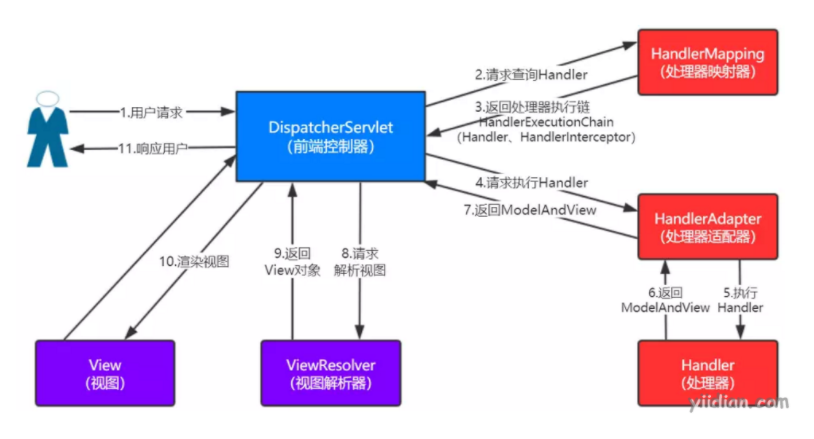  

# SpringMVC @RequestMapping映射    
## 作用
用于建立请求URL和处理请求方法之间的关系。  
## 出现位置  
- 类上  
  很实用，为当前类所有方法的请求地址指定一个基准路径。

- 方法上(一般和方法名保持一致 前端发送请求时需要拼接类上的基准路径)

## 参数(有多个参数时value不能省略)
- value、path ：指定请求的URL。(单个值时可省略)  

- method ：指定请求的方式。(POST、GET、POST、DELETE...)  

- params ：指定限制请求参数的条件。支持简单的表达式，要求请求参数的key和value必须和配置的一模一样(不一致都是404错误)。(只在传参的情况下才有效)  
  - params={"accountName"} ：表示请求参数中必须有accountName  
  - params={"money!100"} ：表示money参数的值不能为100
  - params={"age!=20", "address"}: 表示必须包含age和address的两个请求参数，且age的值必须不为20。

- headers ：指定限制请求消息头的条件。(发送的请求当中必须包含指定的请求头)  
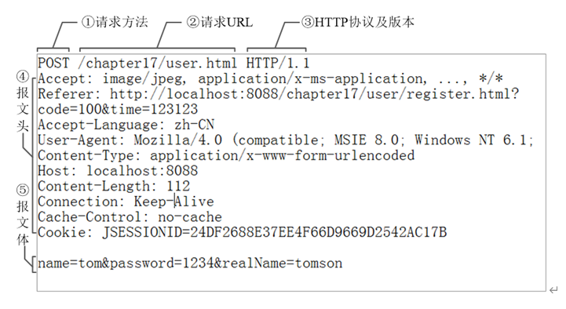

- 各个参数间是与的关系，必须所有参数都满足条件才会执行该方法。

## 支持Ant风格的URL  
- ? ：匹配文件名中的**一个字符**

- * ：匹配多个字符或一层路径 

- ** ：匹配多层路径  

- /user/*/createUser?? ：匹配user任意子集目录下以createUser开头后面两个字符任意的映射  

- /user/**/createUser ：匹配以user为根目录的所有createUser映射
## 获取路径的值 @PathVariable（RESTFUL风格中常用）  
```java
/**
    * 可以使用@PathVariable注解获取请求路径 占位符中内的内容
    * 可以在任意路径写一个占位符{变量名}
    * 路径上的占位符只能占一层路径
    * @param info
    * @return
    */
@RequestMapping("/user/{info}")
public String testPathVariable(@PathVariable("info") String info){
    System.out.println("占位符为："+info);
    return "success";
}
```
# SpringMVC RESTFUL  
## REST    
- 即 Representational State Transfer。（**资源）表现层状态转化**。是目前最流行的一种互联网**软件架构**。 
- 简洁的URL提交请求，以**请求方式**区分对资源的操作。  

## 配置发送RESTFUL风格请求  
- 在控制器方法中使用method属性指定请求方式  
```java
@RequestMapping(value = "/book/{bid}",method = RequestMethod.GET)
public String getBook(@PathVariable("bid") String bid){
    System.out.println("查询了"+bid+"号图书");
    return "success";
}

@RequestMapping(value = "/book/{bid}",method = RequestMethod.POST)
public String addBook(@PathVariable("bid") String bid){
    System.out.println("添加了"+bid+"号图书");
    return "success";
}

@RequestMapping(value = "/deleteBook/{bid}",method = RequestMethod.DELETE)
public String deleteBook(@PathVariable("bid") String bid){
    System.out.println("删除了"+bid+"号图书");
    return "success";
}

@RequestMapping(value = "/updateBook/{bid}",method = RequestMethod.PUT)
public String updateBook(@PathVariable("bid") String bid){
    System.out.println("修改了"+bid+"号图书");
    return "success";
}
```
- web.xml配置RESTFUL风格的过滤器(HiddenHttpMethodFilter  把普通的请求转为规定形式的请求) 
```xml
<!--配置RESTFUL风格的过滤器-->
<filter>
    <filter-name>hiddenHttpMethodFilter</filter-name>
    <filter-class>org.springframework.web.filter.HiddenHttpMethodFilter</filter-class>
</filter>
<filter-mapping>
    <filter-name>hiddenHttpMethodFilter</filter-name>
    <!--设置拦截所有请求-->
    <url-pattern>/*</url-pattern>
</filter-mapping>
```
- 前端页面设置发起其它请求的方式  
  - 创建一个post类型的表单  
  - 表单项中携带一个`_method`的参数  
  - `_method`的值就是RESTFUL风格的具体类型  
```jsp
<a href="book/1">查询图书 </a><br/>

<form action="book/1" method="post">
    <input type="text" name="_method" value="post">
    <input type="submit" value="添加图书">
</form>
<form action="deleteBook/1" method="post">
    <input type="hidden" name="_method" value="DELETE">
    <input type="submit" value="删除图书">
</form>
<form action="updateBook/1" method="post">
    <input type="hidden" name="_method" value="PUT">
    <input type="submit" value="修改图书">
</form>
```
- HiddenHttpMethodFilter源码分析  
```java
protected void doFilterInternal(HttpServletRequest request, HttpServletResponse response, FilterChain filterChain)
			throws ServletException, IOException {

		HttpServletRequest requestToUse = request;
        //判断如果表单是一个post且没有产生javax.servlet.error.exception异常 
		if ("POST".equals(request.getMethod()) && request.getAttribute(WebUtils.ERROR_EXCEPTION_ATTRIBUTE) == null) {
            //获取_method的值
			String paramValue = request.getParameter(this.methodParam);
			if (StringUtils.hasLength(paramValue)) {
                //将_method的值转为大写(PUT DELETE ...)
				String method = paramValue.toUpperCase(Locale.ENGLISH);
                //判断_method的值是否在允许的请求方式内 在的话就创建新的request对象
				if (ALLOWED_METHODS.contains(method)) {
					requestToUse = new HttpMethodRequestWrapper(request, method);
				}
			}
		}

		filterChain.doFilter(requestToUse, response);
	}
```  

## 高版本tomcat(8.0及以上)不支持RESTFUL风格：405错误
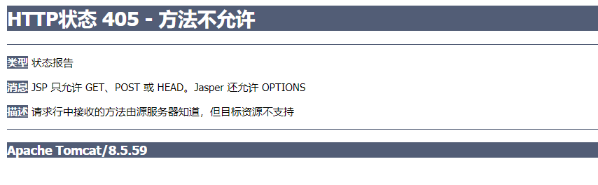  
- 解决方案：在jsp头部`<page>`标签中加上`isErrorPage="true"`属性  
```jsp
<%@ page contentType="text/html;charset=UTF-8" language="java" isErrorPage="true" %>
```
# SpringMVC 请求数据传入  
## 普通类型(方法参数名 区分大小写)  
```java
@Controller
public class UserController {
    //传几个参数就需要在方法上定义几个参数，且方法参数名和传入的参数名必须保持一致
    @RequestMapping("/hello")  
    public String save(String username,String password){
        System.out.println("执行了保存操作");
        return "success";
    }
}
```
```jsp
<a href="hello?username=fish&password=123">get connection to web</a>
```
## POJO对象(属性名 必须提供get、set方法)
```java
public class Account implements Serializable {
    private Integer id;
    private Double money;
    private Integer uid;
}
//控制器：
@Controller
@RequestMapping("/param")
public class ParamController {
    @RequestMapping("/getAccount")
    //前端传入的参数用Account类封装
    public String getAccount(Account account){
        System.out.println("获取到的前端数据"+account);
        return "success";
    }
}
```
```jsp
<form action="param/getParam" method="post">
    id：<input type="text" name="id"><br/>
    money：<input type="text" name="money"><br/>
    uid：<input type="text" name="uid"><br/>
</form>
```
## POJO内置对象(对象名.属性名)
```java
public class Account implements Serializable {
    private Integer id;
    private Double money;
    private Integer uid;
    private User user;
}
//控制器：
@Controller
@RequestMapping("/param")
public class ParamController {
    @RequestMapping("/getParam")
    //前端传入的参数用Account类封装
    public String getParam(Account account){
        System.out.println("获取到的前端数据"+account);
        return "success";
    }
}
```
```jsp
<form action="param/getParam" method="post">
    id：<input type="text" name="id"><br/>
    money：<input type="text" name="money"><br/>
    user.username：<input type="text" name="user.username"><br/>
    user.sex：<input type="text" name="user.sex"><br/>
</form>
```
## POJO集合对象(集合名.属性名)
```java
public class User implements Serializable {
    //所有属性名字必须和前端名字相对应
    private Integer id;
    private String username;
    private String sex;
    private String address;
    private Date birthday;
    private List<Account> accounts;
    private Map<String,Account> maps;
}
//控制器：
@Controller
@RequestMapping("/param")
public class ParamController {
    @RequestMapping("/getCollection")
    public String getCollection(User user){
        System.out.println("获取到的前端数据"+user);
        return "success";
    }
}
```
```jsp
<form action="param/getCollection" method="post">
    id：<input type="text" name="id"><br/>
    username：<input type="text" name="username"><br/>
    sex：<input type="text" name="sex"><br/>
    //以list集合方式传入数据
    aid-list：<input type="text" name="accounts[0].id"><br/>
    money-list：<input type="text" name="accounts[0].money"><br/>
   //以map方式传入数据
    aid-map：<input type="text" name="maps['a1'].id"><br/>
    money-map：<input type="text" name="maps['a1'].money"><br/>
    <input type="submit" value="Commit">
</form>
```
## 自定义类型转换器（实现Converter<S,T>接口 配置日期类型等）  
- 编写一个自定义类型转换类，实现Converter接口  
```java
//1. 编写一个自定义类型转换类，实现Converter接口
public class StringToDateUtil implements Converter<String, Date> {
    //source:页面传入的字符串
    public Date convert(String source) {
        if (source==null){
            throw new RuntimeException("传入的数据不能为空");
        }
        DateFormat df = new SimpleDateFormat("yyyy-MM-dd");
        try {
            return df.parse(source);
        } catch (ParseException e) {
            throw new RuntimeException("日期格式不对");
        }
    }
}
```
- 在SpringMVC核心配置文件(springmvc.xml)中配置自定义类型转换器(将自定义的注册到Spring转换器中)  

- 让配置生效(在`mvc:annotation-driven`中注册)
```xml
<!--2. 将自定义类型转换器注册到Spring转换器中(ConversionServiceFactoryBean)
如果使用默认的ConversionServiceFactoryBean，则数据格式化会失效，必须改为FormattingConversionServiceFactoryBean才行
-->
<bean id="conversionService" class="org.springframework.context.support.ConversionServiceFactoryBean">
   <!--Spring所有转换器是用set集合封装-->
    <property name="converters">
        <set>
            <bean class="com.ralife.utils.StringToDateUtil"></bean>
        </set>
    </property>
</bean>
<!--3. 让配置生效-->
<mvc:annotation-driven conversion-service="conversionService"></mvc:annotation-driven>
```
## 中文乱码 
web.xml中配置字符编码过滤器：  
```xml
<!--配置字符编码过滤器（解决post提交中文乱码）-->
<filter>
    <filter-name>characterEncodingFilter</filter-name>
    <filter-class>org.springframework.web.filter.CharacterEncodingFilter</filter-class>
    
    <!--设置POST请求要使用的字符集-->
    <init-param>
        <param-name>encoding</param-name>
        <param-value>UTF-8</param-value>
    </init-param>
    <!--设置响应字符集-->
    <init-param>
        <param-name>forceEncoding</param-name>
        <param-value>true</param-value>
    </init-param>
</filter>

<filter-mapping>
    <filter-name>characterEncodingFilter</filter-name>
    <url-pattern>/*</url-pattern>
</filter-mapping>

<!--配置tomcat配置文件 server.xml（解决get、ajax提交中文乱码）-->
<Connector  connectionTimeout="20000"  port="8080" 
      protocol="HTTP/1.1"  redirectPort="8443"/> 
<!--改为：--> 
<Connector  connectionTimeout="20000"  port="8080"  
      protocol="HTTP/1.1"  redirectPort="8443"  
      useBodyEncodingForURI="true"/> 
<!--如果遇到 ajax 请求仍然乱码，把： 
  useBodyEncodingForURI="true"改为 URIEncoding="UTF-8" 
即可。 -->
```
## 在控制器中使用原生的ServletAPI对象  
直接在控制器的方法参数定义即可：  
```java
@RequestMapping("/testServlet")
public String testServlet(HttpServletRequest request, HttpServletResponse response){
    //获取session
    HttpSession session = request.getSession();
    return "success";
}
```
## @RequestParam注解  
- 作用在**方法参数**上，可以把请求参数传递给请求方法，使用该注解请求**默认是必须带参数的**。     
```java
@RequestMapping("/hello")
public String testRequestParam(@RequestParam(name = "name") String username){
    //相当于 username = request.getAttribute("name");
    //如果请求参数名和方法的参数名一致 @RequestParam可以不写
    return "success";
}
```
- 常用属性  
  - value、name ：指定要获取的参数的key
  - required ：指定请求是否必须带这个参数  
  - defaultValue ：指定参数的默认值，没带默认是null  

- 和`@PathVariable`注解的区别  
`@RequestParam`用于获取**参数的值**，而`@PathVariable`用于获取**路径的值**。  

## @RequestHeader注解  
- 作用在**方法参数**上，用于获取**请求头**中某个key的值，如果请求头中没有指定的key会报错(可通过required属性解决)。  
```java
@RequestMapping("/hello")
public String testRequestHeader(@RequestHeader("User-Agent") String userAgent){
    //等同于 userAgent = request.getHeader("User-Agent");
    return "success";
}
```  
## @CookieValue注解  
- 作用在**方法参数**上，用于获取某个cookie的值。  

## @RequestBody注解  
- 作用在**方法参数**上，用于获取请求体内容（只有post请求才会有请求体）。直接使用得到是 key=value&key=value...结构的数据。(默认情况下get请求方式不适用 会报错)

- 导入jackson包后可以用于接收用户ajax提交的json数据，封装为对象。

- 属性：  
required ：是否必须有请求体。默认值是:true。当取值为 true 时,get 请求方式会报错。如果取值为 false，get 请求得到是 null。 

## @ModelAttribute注解（非常实用）  
- 作用在方法上 ：表示当前方法会在控制器的方法执行之前先执行。它可以修饰没有返回值的方法(将返回值放在map内)，也可以修饰有具体返回值的方法。   

- 作用在参数上 ：获取指定的数据给参数赋值。（方法没有返回值时使用） 

- 属性： 
value ：用于获取数据的 key。key 可以是 POJO 的属性名称，也可以是 map 结构的 key。   

- 应用场景：  
当表单提交数据不是完整的实体类数据时，保证没有提交数据的字段使用数据库对象原来的数据。（有Mybatis时不推荐使用该注解 Mybatis会帮我们自动处理好） 

- 作用在有返回值方法案例：  
```java
@ModelAttribute
public User findByName(String username){
    User user = new User();
    user.setId(12);
    user.setUsername("FISH");
    user.setSex("男");
    user.setAddress("Paris");
    user.setBirthday(new Date());
    System.out.println("before add:"+user);
    return user;
}

@RequestMapping("/addUser")
public String addUser(User user){
    System.out.println("after add:"+user);
    return "success";
}
```
- 作用在无返回值方法案例（推荐使用 使用Map封装结果 且map必须放在方法参数内）：  
```java
/**
@ModelAttribute标准的方法会提前运行并把方法的运行结果放在隐含模型中；  
放的时候会使用一个key 如果没指定 默认key为返回类型小写
也可以通过@ModelAttribute("book")指定
*/
@ModelAttribute
public void findById(Integer id, Map<String,User> map){
    User user = new User();
    user.setId(18);
    user.setUsername("Jans");
    user.setSex("女");
    user.setAddress("London");
    user.setBirthday(new Date());
    System.out.println("before update:"+user);
    map.put("user",user);
}

@RequestMapping("/updateUser")
public String updateUser(@ModelAttribute("user") User user){
    System.out.println("after update:"+user);
    return "success";
}
```
## @SessionAttributes注解（不推荐使用）  
- **作用在类上**，用于保存当前控制器所有方法共享的参数(和HttpSession类似)    

- 给`BindingAwareModelMap`或`ModelAndView`中保存的数据，同时给session中放一份。  

- 属性：  
  - value={"msg"} ：指定key为"msg"的数据保存到session中。  

  - types={String.class,Integer.class} ：指定String类型和Integer类型的数据都保存到session中。  

- 使用该注解可能会引发异常，给session中放数据推荐使用原生API。(控制器方法中加入HttpSession参数)  

- 案例：
```java
@Controller
@RequestMapping(path="/user")
@SessionAttributes(value= {"username","password","age"},types= 
{String.class,Integer.class})      
public class HelloController {
    /**
     * 向session中存入值
     * @return
     */
    @RequestMapping(path="/save")
    public String save(Model model) {
        System.out.println("向session域中保存数据");
        model.addAttribute("username", "root");
        model.addAttribute("password", "123");
        model.addAttribute("age", 20);
        return "success";
    }
     /**
     * 从session中获取值
     * @return
     */
    @RequestMapping(path="/find")
    public String find(ModelMap modelMap) {
        String username = (String) modelMap.get("username");
        String password = (String) modelMap.get("password");
        Integer age = (Integer) modelMap.get("age");
        System.out.println(username + " : "+password +" : "+age);
        return "success";
    }

     /**
     * 清除值
     * @return
     */
    @RequestMapping(path="/delete")
    public String delete(SessionStatus status) {
         status.setComplete();
        return "success";
    }
}
```
# SpringMVC 响应数据传出  
## 通过传统的request、session、application对象传出数据(不推荐)  
```java
@RequestMapping("/handler01")
public String handler01(HttpServletRequest request){
    request.setAttribute("msg","request hello word");
    return "success";
}
```  
## 通过Map、Model、ModelMap对象传出数据（request结果集）  
Spring底层都是用`BindingAwareModelMap`对象进行保存。
```java
@RequestMapping("/handler02")
public String handler02(Map<String,Object> map){
    map.put("msg","map hello word");
    return "success";
}

@RequestMapping("/handler03")
public String handler03(Model model){
    model.addAttribute("msg","model hello word");
    return "success";
}

@RequestMapping("/handler04")
public String handler04(ModelMap modelMap){
    modelMap.addAttribute("msg","modelMap hello word");
    return "success";
}
```
## 通过ModelAndView对象传出数据(request结果集 最常用)
```java
@RequestMapping("/handler05")
public ModelAndView handler05(){
    ModelAndView mav = new ModelAndView();
    mav.setViewName("success");
    mav.addObject("msg","ModelAndView hello word");
    return mav;
}
```
# SpringMVC 视图解析  
## 转发和重定向的区别  
区别|转发|重定向
:-:|:-:|:-:
根目录|包含项目访问地址|没有项目访问地址(如果重定向到页面不手动加项目名会404)
地址栏|不会发生改变|会发生改变
请求次数|1次|2次
哪里跳转|服务器端进行跳转|浏览器端进行跳转
请求域中的数据|不会丢失|会丢失
应用场景|查询(需要保存请求域中的数据)|增、删、改
使用的方法|`request.getRequestDispatcher("/two").forward(request, response)`|`response.sendRedirect("two")`  
## 跳转到视图解析器拼接规则之外页面的方法  
案例：(视图解析器的前缀为"/WEB-INF/pages/",后缀为".jsp",要跳转到项目根目录下的hello.jsp页面)
- 使用**相对路径**
```java
@RequestMapping("/handle01")
public String handle01(){
    //直接使用/hello.jsp无效 会拼接为/WEB-INF/pages/hello.jsp.jsp
    return "../../hello";
} 
```
- 使用`forward:`前缀**转发**(不会进入视图解析器 需要写完整路径)  
```java
@RequestMapping("/handle02")
public String handle02(){
    // /hello.jsp表示当前项目下的hello.jsp 必须得加上/ 否则容易出问题
    return "forward:/hello.jsp";
    //支持跳转到另一个请求(请求域中的数据也会发送过去)
    //return "forward:/handle01";
}
```
- 使用`redirect:`前缀**重定向**(不会进入视图解析器 需要写完整路径)  
```java
@RequestMapping("/handle03")
public String handle03(){
    //传统response方法重定向到页面必须加项目名
    //springmvc会自动为我们拼接上项目名 因而可以省略
    return "redirect:/hello.jsp";
    //支持多次重定向
    //return "redirect:/handle03";
}
```  
## SpringMVC 视图解析原理 
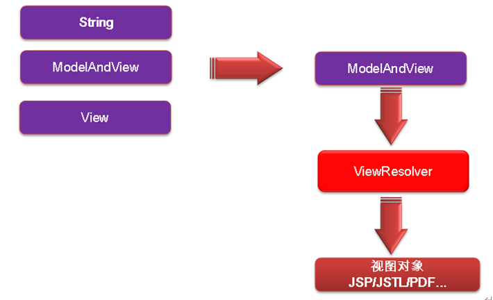    
- 控制器任何方法的返回值最终都会被包装成ModelAndView对象。  

- 视图渲染流程：将域中数据在页面中展示。

- ViewResolver 的唯一作用是根据视图名(方法的返回值)得到View对象。  

- 视图解析器只是为了得到视图对象(View)；视图对象才能真正的转发(将模型数据全部放入请求域中)或重定向到页面；视图对象才能真正的渲染视图。   

- 如果配置了外部的 ViewResolver(需要添加相关依赖)，SpringMVC会自动使用我们引入的ViewResolver，而不是默认的InternalResourceViewResolver。
## 视图 View
- 视图的作用是**渲染模型数据**，将模型里的数据以某种形式呈现给客户。  

- 为了实现视图模型和具体实现技术的解耦，Spring 在 org.springframework.web.servlet 包中定义了一个高度抽象的 View 接口。  

- 视图对象**由视图解析器负责实例化**。由于视图是**无状态的**，所以他们**不会有线程安全的问题**。  

- 常用的视图：`InternalResourceView`、`JstlView`、`AbstractExcelView`。
## 视图解析器 ViewResolver  
- SpringMVC 为逻辑视图名的解析提供了不同的策略，可以在 Spring WEB 上下文中**配置一种或多种解析策略，并指定他们之间的先后顺序**。每一种映射策略对应一个具体的视图解析器实现类。  

- 视图解析器的作用比较单一：将**逻辑视图**解析为一个**具体的视图对象**。  

- 所有的视图解析器都必须实现 ViewResolver 接口。  

- 常用的视图解析器：  
  - `InternalResourceViewResolver` ：将视图解析为一个URL文件。
  - `BeanNameViewResolver` ：将逻辑视图名解析为一个Bean，Bean的id等于逻辑视图名。  

- 程序员可以选择一种视图解析器或混用多种视图解析器。  

- 每个视图解析器都实现了 Ordered 接口并开放出一个 order 属性，**可以通过 order 属性指定解析器的优先顺序，order  越小优先级越高。**  

- SpringMVC 会按视图解析器顺序的优先顺序对逻辑视图名进行解析，直到解析成功并返回视图对象，否则将抛出 ServletException 异常。

## JstlView  
将国际化资源交给Spring管理，我们添加好国际化资源，直接在页面使用`<fmt:message>`即可获取资源。  

- 若项目中使用了JSTL，则SpringMVC 会**自动**把视图由InternalResourceView转为 JstlView ：
```xml
<bean class="org.springframework.web.servlet.view.InternalResourceViewResolver">
    <property name="prefix" value="/pages/"></property>
    <property name="suffix" value=".jsp"></property>
    <!--指定使用JstlView创建视图对象-->
    <property name="viewClass" value="org.springframework.web.servlet.view.JstlView"></property>
</bean>
```
- 若使用 JSTL 的 fmt 标签则需要在 SpringMVC 的配置文件中配置国际化资源文件：
```xml
<!--添加tomcat标签库依赖-->
<dependency>
    <groupId>org.apache.taglibs</groupId>
    <artifactId>taglibs-standard-impl</artifactId>
    <version>1.2.5</version>
    <type>bundle</type>
</dependency>
<dependency>
    <groupId>org.apache.taglibs</groupId>
    <artifactId>taglibs-standard-spec</artifactId>
    <version>1.2.5</version>
    <type>bundle</type>
</dependency>
```
- 在类路径下添加国际化资源文件：
```properties
# i18n_zh_CN.properties
nameLabel=名字
namePlace=请输入名字
pswLabel=密码
pswPlace=请输入密码
commitBtn=登录

# i18n_en_US.properties
nameLabel=UserName
namePlace=Please input username
pswLabel=Password
pswPlace=Please input password
commitBtn=Login
```
- springmvc.xml配置国际化资源文件：
```xml
<!--配置资源文件管理器  id必须为messageSource否则无效-->
<bean id="messageSource" class="org.springframework.context.support.ResourceBundleMessageSource">
    <!--指定国际化文件基础名-->
    <property name="basename" value="i18n"></property>
</bean>
```
- 存在的问题  
  - 国际化页面**不能直接访问**，必须通过发送请求交给Spring处理之后才能得到国际化资源文件。(一定要过SpringMVC视图解析流程，创建一个JstlView帮我们快速国际化)    

  - 控制器方法返回值**不能有转发或者重定向前缀**(不经过视图解析器)  

  - 要访问国际化页面每次都需要发送一个请求（使控制器中存在大量不处理业务逻辑的方法  可通过配置springmvc配置文件解决）
  
- 若希望直接响应通过 SpringMVC 渲染的页面(取代通过控制器的方法响应)，可以使用`<mvc:view-controller>`标签实现：
```xml  
<!--配置国际化页面的访问  path：指定哪个请求  view-name：指定视图名(国际化页面名 可以使用转发、重定向前缀)-->
<mvc:view-controller path="/forwardLogin" view-name="login"></mvc:view-controller>
```
**配置`<mvc:view-controller>`会导致其他请求路径失效**；解决方案：**配置`<mvc:annotation-driven>`标签**：  
```xml
<mvc:annotation-driven/>
```
## 自定义视图和视图解析器
- 编写自定义的视图解析器和视图实现类  

- 将视图解析器放入IOC容器中，并让其实现排序接口，并设置order属性的值，否则还是会使用Spring默认的视图解析器(优先级最低的)。
# SpringMVC RESTFUL_CRUD  
- 创建Maven项目，添加相关依赖  

- 配置web.xml(前端控制器、字符编码、REST风格支持)  

- 配置springmvc.xml(组件扫描、视图解析器、注解驱动)

- 配置数据库连接和dao层（使用阿里的德鲁伊数据库 测试连接）

- 添加页面(登录、展示(修改、删除)、修改、删除、添加页面  可以引入springmvc表单标签方便操作)  

- 前端任意请求前需要加上`request.getContextPath()`   

- **同一个标签内不能加多个class属性**，不然会无效 
  
- 400 ：一般都是提交的数据类型和后台无法对应起来

- 405 ：提交的请求URL或者请求方法和控制层的不对应(或者是tomcat8及以上不支持rest风格)  
# SpringMVC 数据绑定流程
## 数据绑定流程原理(前端数据如何被转为JavaBean的)
- Spring MVC主框架将 ServletRequest 对象及目标方法的入参实例传递给 WebDataBinderFactory 实例，以创建 **DataBinder**(数据绑定的核心) 实例对象。  

- DataBinder 调用装配在 Spring MVC 上下文中的 **ConversionService** 组件进行**数据类型转换、数据格式化**工作。将 Servlet 中的请求信息填充到入参对象中。  

- 调用 **Validator** 组件对已经绑定了请求消息的入参对象进行数据合法性校验，并最终生成数据绑定结果 **BindingData** 对象。  

- Spring MVC 抽取 BindingResult 中的入参对象和校验错误对象，将它们赋给处理方法的响应入参。  

Spring MVC 通过反射机制对目标处理方法进行解析，将请求消息绑定到处理方法的入参中。数据绑定的核心部件是 DataBinder，运行机制如下：
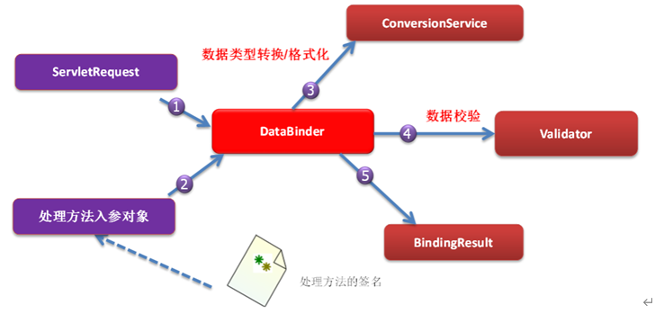  

## 自定义类型转换器(String--JavaBean)
- 第一步：创建自定义类型转换器类,实现`Converter<S,T>`接口,在convert()方法自定义转换方式：
```java
public class StringToConvertion implements Converter<String, User> {
    public User convert(String source) {
        User user = new User();
        if(source!=null&&source.contains("-")){
            String[] args = source.split("-");
            user.setUsername(args[0]);
            user.setPassword(args[1]);
            user.setSex(args[2]);
            user.setAddress(args[3]);
        }
        return user;
    }
}
```
- 第二步：将自定义类型转换器注册到springmvc转换服务容器中：
```xml
<!--推荐使用FormattingConversionServiceFactoryBean 可以包含数据格式化-->
<bean id="conversionService" class="org.springframework.format.support.FormattingConversionServiceFactoryBean">
    <!--通过converters 属性注册自定义的类型转换器-->
    <property name="converters">
        <set>
            <bean class="com.ralife.convertion.StringToConvertion"></bean>
        </set>
    </property>
</bean>
```  
- 第三步：告诉springmvc要使用我们自定义的转换服务：  
```xml
<mvc:annotation-driven conversion-service="conversionService"></mvc:annotation-driven>
```   
### `<mvc:annotation-driven/>`在什么时候必须配置    
- 通过`<mvc:view-controller>`直接配置响应页面，无需经过控制器来执行结果；会导致其它请求路径失效，此时必须加上注解驱动。 

- 加载静态资源（必须和`<mvc:default-servlet-handler/>` [将所有请求交给 WEB 应用服务器默认的 Servlet 处理] 一起使用）   

- 使用自定义类型转换器  

- 完成JSR 303数据校验，需要加上注解驱动才能生效。  

### `<mvc:annotation-driven/>`的作用  
- 它会自动注册：
`RequestMappingHandlerMapping `、`RequestMappingHandlerAdapter `与
`ExceptionHandlerExceptionResolver  `三个bean。  

- 支持使用 **ConversionService** 实例对表单参数进行**类型转换**。  

- 支持使用 @NumberFormat、@DateTimeFormat 注解完成数据类型的**格式化**。  

- 支持使用 @Valid 注解对 JavaBean 实例进行 **JSR 303 验证**。  

- 支持使用 @RequestBody 和 @ResponseBody 注解。  

- 加载静态资源时有和没有`<mvc:annotation-driven/>`的区别：  

`<mvc:default-servlet-handler/>`|`<mvc:annotation-driven/>`|使用的适配器|支持的功能 
-|-|-|-
没有|没有|AnnotationMethodHandlerAdapter(默认出厂设置 过时)|不支持conversionService(类型转换)和静态资源加载  
有|没有|无|只支持静态资源加载(将所有请求交给Tomcat处理)
有|有| **RequestMappingHandlerAdapter** |支持所有功能
### InitBinder注解
- 由 @InitBinder 标识的**方法**，可以**对 WebDataBinder 对象进行初始化**。WebDataBinder 是 DataBinder 的子类，用于完成由表单字段到 JavaBean 属性的绑定。  

- @InitBinder方法不能有返回值，它必须声明为void。

- @InitBinder方法的参数通常是 WebDataBinder。
## 数据格式化
### 基本概念
- 对属性对象的输入/输出进行格式化，从其本质上讲依然属于 “类型转换” 的范畴。

- Spring 在格式化模块中定义了一个实现 ConversionService 接口的FormattingConversionService 实现类，该实现类扩展了 GenericConversionService，因此它**既具有类型转换的功能，又具有格式化的功能**。  

- FormattingConversionService 拥有一个 **FormattingConversionServiceFactroyBean** 工厂类，后者用于在 Spring 上下文中构造前者，FormattingConversionServiceFactroyBean 内部已经注册了 :  
  - NumberFormatAnnotationFormatterFactroy（**@NumberFormat** 注解）：数字类型格式化  

  - JodaDateTimeFormatAnnotationFormatterFactory（**@DateTimeFormat** 注解）：日期类型格式化   

- 装配了 FormattingConversionServiceFactroyBean 后，就可以在 Spring MVC 入参绑定及模型数据输出时使用注解驱动了。  

- 格式错误都是400错误

- **必须使用FormattingConversionServiceFactoryBean**作为springmvc默认的转换服务、否则还是会报400错误。  

- 类型转换失败，可通过 **BindingResult** 获取错误信息：  
```java
@RequestMapping("/user")
public ModelAndView saveUser(User user, BindingResult bindingResult){
    //如果存在格式错误
    if(bindingResult.getErrorCount()>0){
        //获取 错误的字段 及 错误提示
        List<FieldError> fieldErrors = bindingResult.getFieldErrors();
        for(FieldError error : fieldErrors){
            System.out.println(error.getField()+"---"+error.getDefaultMessage());
        }
    }
    ModelAndView mav = new ModelAndView();
    System.out.println(user);
    mav.setViewName("success");
    mav.addObject("user",user);
    return mav;
}
```
### 日期格式化
- @DateTimeFormat 注解可对 java.util.Date、java.util.Calendar、java.long.Long 时间类型进行标注：    
  
  - **pattern** 属性：类型为字符串。指定解析/格式化字段数据的模式，如：”yyyy-MM-dd hh:mm:ss”。  

- @NumberFormat 可对类似数字类型的属性进行标注，它拥有两个互斥的属性：  
  - style：类型为 NumberFormat.Style。用于指定样式类型，包括三种：Style.NUMBER（正常数字类型）、 Style.CURRENCY（货币类型）、 Style.PERCENT（百分数类型）  

  - **pattern** ：类型为 String，自定义样式，如pattern="#,###"；
## 数据校验(JSR 303)
### JSR 303
- 是 Java 为 Bean 数据合法性校验提供的标准框架，它已经包含在 JavaEE 6.0 中。

- JSR 303 (Java Specification Requests意思是**Java 规范提案**)通过**在 Bean 属性上标注**类似于 @NotNull、@Max 等标准的注解指定校验规则，并通过标准的验证接口对 Bean 进行验证。  

- 支持的校验有：  
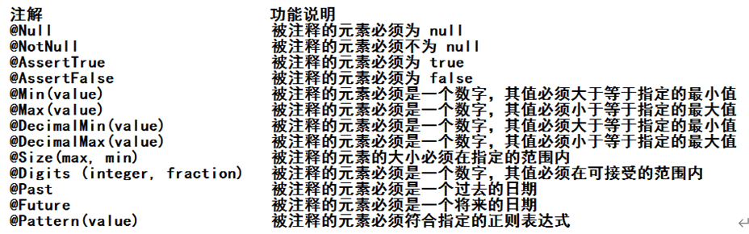  

### Hibernate Validator  
- 是 JSR 303 的一个参考实现，除支持所有标准的校验注解外，它还支持以下的扩展注解：
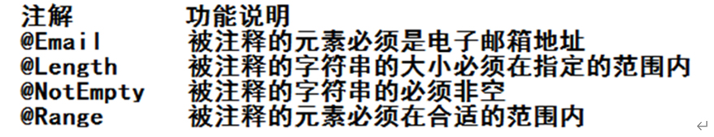  

- 需要添加的依赖：
```xml
```
### SpringMVC 数据校验
- 在 Spring MVC 中，可直接通过注解驱动的方式进行数据校验；

- Spring 的 **LocalValidatorFactroyBean** 既实现了 Spring 的 Validator 接口，也实现了 JSR 303 的 Validator 接口。只要在 Spring 容器中定义了一个 LocalValidatorFactoryBean，即可将其注入到需要数据校验的 Bean 中。  

- Spring 本身并没有提供 JSR303 的实现，所以**必须将 JSR303 的实现者的 jar 包放到类路径下**。  

- **<mvc:annotation-driven/> 会默认装配好一个 LocalValidatorFactoryBean**，通过在处理方法的入参上标注 **@Valid** 注解即可让 Spring MVC 在完成数据绑定后执行数据校验的工作。  

- **需校验的 Bean 对象和其绑定结果对象或错误对象(BindingResult)是成对出现的，它们之间不允许声明其他的入参**。
### 校验步骤 
- 引入hibernate validator验证框架

- SpringMVC配置文件中增加<mvc:annotation-driven/>

- 在bean的属性上增加对应验证的注解

- 目标方法bean类型的前面增加@Valid注解

- 将BindingResult中的错误信息保存到隐含模型中

### 在页面上显示错误信息 
- 导入form标签库，通过 <form:errors path=“userName”> 显示错误消息。 

- 将错误信息保存到隐含模型中。

## JSON格式数据转换  
- 导包：
```xml
<dependency>
    <groupId>com.fasterxml.jackson.core</groupId>
    <artifactId>jackson-databind</artifactId>
    <version>2.9.9.3</version>
</dependency>
<dependency>
    <groupId>com.fasterxml.jackson.core</groupId>
    <artifactId>jackson-core</artifactId>
    <version>2.9.9</version>
</dependency>
<dependency>
    <groupId>com.fasterxml.jackson.core</groupId>
    <artifactId>jackson-annotations</artifactId>
    <version>2.9.9</version>
</dependency>
```
- 写配置(控制器方法的返回类型设置为要返回的对象类型  在方法上加上@ResponseBody注解  返回前端的数据直接就是JSON格式数据)： 

- bean中不需要转成JSON格式的属性上可以加上 **@JsonIgnore** 注解。  

- 默认的日期类型返回是一串数字（日期类型属性上需要加书 **@JsonFormat**(pattern="yyyy-MM-dd")）。

- 可以使用@RequestBody(作用在方法参数上)获取前端提交的json数据，并封装成JavaBean对象。 

- 如果参数位置写 HttpEntity<String> 比@RequestBody更强大，还可以拿到请求头的数据。

- 可以将方法返回类型设置为ResponseEntity<String>，来实现定制自己的响应。
# SpringMVC 国际化
- 写好国际化资源文件  

- 让Spring的ResourceBundleMessageSource管理国际化资源文件  

- 前端引入 fmt 标签直接获取国际化资源  

- 所有用到区域信息的地方，默认都是用到`AcceptHeaderLocaleResolver`获取的(通过request.getLocale()方法获取Locale对象)。  

- `FixedLocaleResolver`：使用系统默认的国际化解析器。  

- `SessionLocaleResolver`：从session中获取区域信息。
## 自定义国际化资源解析器
- 自定义解析类实现LocaleResolver接口（可直接通过配置LocaleChangeInterceptor拦截器实现？）：  
```java
public class MyLocale implements LocaleResolver {
    public Locale resolveLocale(HttpServletRequest request) {
        Locale locale = null;
        //获取用户提交的locale参数来确定具体使用哪种区域信息
        String localeInfo = request.getParameter("locale");
        //如果不为空就根据传来的区域信息创建Locale对象  Locale(String language, String country)
        if(localeInfo!=null&&!"".equals(localeInfo)){
            String[] infos = localeInfo.split("_");
            locale = new Locale(infos[0],infos[1]);
        }else {
            //如果为空就使用浏览器默认的Locale
            locale = request.getLocale();
        }
        return locale;
    }

    public void setLocale(HttpServletRequest request, HttpServletResponse response, Locale locale) {
        throw new UnsupportedOperationException(
                "Cannot change HTTP accept header - use a different locale resolution strategy");
    }
}
```
- 将自定义国际化解析器注册到spring容器中  
```xml
<!--绑定国际化资源解析器-->
<bean id="messageSource" class="org.springframework.context.support.ResourceBundleMessageSource">
    <property name="basename" value="login"></property>
</bean>

<!--将自定义国际化解析器注册到spring容器中  id必须为localeResolver否则无效-->
<bean id="localeResolver" class="com.ralife.locale.MyLocale"></bean>

<!--模拟页面跳转-->
<mvc:view-controller path="/goLogin" view-name="login"></mvc:view-controller>
<mvc:default-servlet-handler/>
<mvc:annotation-driven/>
```  
- 前端页面导入fmt补签库，提交请求时添加locale参数  
```html
<form>
    <fmt:message key="login_username"></fmt:message>:<input type="text" name="username"><br>
    <fmt:message key="login_psw"></fmt:message>:<input type="text" name="password"><br>
    <button type="button"><fmt:message key="login_login"></fmt:message></button>
    <button type="button"><fmt:message key="login_register"></fmt:message></button>
    <a href="goLogin?locale=zh_CN">中文</a>
    <a href="goLogin?locale=en_US">英文</a>
</form>
```
# SpringMVC 文件上传
## 简介  
- Spring MVC 为文件上传提供了直接的支持，这种支持是通过即插即用的 **MultipartResolver** 实现的。   

- Spring MVC 上下文中默认没有装配 MultipartResovler，因此**默认情况下不能处理文件的上传工作**，如果想使用 Spring 的文件上传功能，需现在上下文中配置 MultipartResolver。  

- 如果要使用`CommonsMultipartResolver`必须先添加文件上传相关依赖。
## 需要的依赖
```xml
<dependency>
    <groupId>commons-fileupload</groupId>
    <artifactId>commons-fileupload</artifactId>
    <version>1.4</version>
</dependency>
<dependency>
    <groupId>commons-io</groupId>
    <artifactId>commons-io</artifactId>
    <version>2.8.0</version>
</dependency>
```
## 获取文件的完整路径
```java
String realPath = request.getSession().getServletContext().getRealPath("/uploads");
```
## 单文件上传
- springmvc 核心配置文件注册文件上传解析器：
```xml
<!--1. 注册文件上传解析器-->
<bean id="multipartResolver" class="org.springframework.web.multipart.commons.CommonsMultipartResolver">
    <!--defaultEncoding: 必须和用户JSP的pageEncoding属性一致，以便正确解析表单的内容-->
    <property name="defaultEncoding" value="UTF-8"></property>
    <!--2. 设置文件大小-->
    <property name="maxUploadSize" value="#{1024*1024*20}"></property>
</bean>
```
- 前端使用form标签的post提交方式， **并设置`enctype`属性为`multipart/form-data`**
```html
<form role="form" action="${ctp }/upload" method="post" enctype="multipart/form-data">
    <div class="form-group">
        <label for="name">名称</label>
        <input type="text" class="form-control" id="name" name="username"
                placeholder="请输入名称">
    </div>
    <div class="form-group">
        <label for="inputfile">文件上传</label>
        <input type="file" name="video" id="inputfile">
        <p class="help-block">最大20M</p>
    </div>
    <button type="submit" class="btn btn-default">提交</button></form>
``` 
- 控制器方法中使用 **MultipartFile** 获取文件项：  
```java
@RequestMapping("/upload")
public String upload(String username, @RequestParam("video") MultipartFile file, Model model){
    System.out.println("username: "+username);
    //通过file.getOriginalFilename()获取文件名
    System.out.println("filename: "+file.getOriginalFilename());
    try {
        String path = "E:\\"+file.getOriginalFilename();
        file.transferTo(new File(path));
        model.addAttribute("msg","SUCCESS");
    } catch (IOException e) {
        model.addAttribute("msg","ERROR"+e.getMessage());
        e.printStackTrace();
    }
    return "success";
}
```
## 多文件上传  
- 前端所有文件项的名字都相同，直接使用 **MultipartFile[]** ：
```java
//多文件上传如果所有文件的表单名相同，直接使用MultipartFile[]即可
//否则每个不同的表单名都需要封装一个单独的MultipartFile对象
@RequestMapping("/mutiUpload")
public String mutiUpload(String username,@RequestParam("video") MultipartFile[] files, Model model){
    System.out.println("username: "+username);
    for(MultipartFile file : files){
        //做一个文件不为空的判断
        if(!file.isEmpty()){
            try {
                file.transferTo(new File("E:\\"+file.getOriginalFilename()));
                model.addAttribute("msg","SUCCESS");
            } catch (IOException e) {
                model.addAttribute("msg","ERROR"+e.getMessage());
                e.printStackTrace();
            }
        }
    }
    return "success";
}
```  
- 前端文件项的名字不同，每一个文件项对应一个单独的MultipartFile对象：
```java
@RequestMapping("/mutiUpload")
public String mutiUpload(String username,@RequestParam("video") MultipartFile head, MultipartFile body, Model model){
    System.out.println("username: "+username);
    try {
        head.transferTo(new File("E:\\"+head.getOriginalFilename()));
        body.transferTo(new File("E:\\"+body.getOriginalFilename()));
        model.addAttribute("msg","SUCCESS");
    } catch (IOException e) {
        model.addAttribute("msg","ERROR"+e.getMessage());
        e.printStackTrace();
    }
    return "success";
}
```
# SpringMVC 文件下载
```java
@RequestMapping("/download")
public void download(@RequestParam("url") String url, HttpSession session, HttpServletResponse response) throws IOException {
    System.out.println("url: "+url);
    //1.根据传入的url确定文件的路径并读取文件
    InputStream is = session.getServletContext().getResourceAsStream(url);
    //2.设置响应头并输出文件
    response.setHeader("Content-Disposition","attachment;filename=demo.png");
    OutputStream os = response.getOutputStream();
    byte[] buf = new byte[1024];
    int len = 0;
    while ((len=is.read(buf)) != -1){
        os.write(buf,0,len);
    }
    //3.关闭资源
    os.close();
    is.close();
    System.out.println("download success!");
}
```
# SpringMVC 拦截器
## 简介
Spring MVC也可以使用拦截器对请求进行拦截处理，用户可以自定义拦截器来实现特定的功能，**自定义的拦截器必须实现HandlerInterceptor接口** ：  
- preHandle() ：在控制器方法执行之前执行；如果程序员决定该拦截器对请求进行拦截处理后还要调用其他的拦截器，或者是业务处理器去进行处理，则返回true；如果程序员决定不需要再调用其他的组件去处理请求，则返回false。  

- postHandle() ：在控制器方法执行之后执行；

- afterCompletion() ：在页面渲染完成之后（来到目标页面之后）执行；可以在该方法中进行一些资源清理的操作。  

- 可以定义拦截器链，拦截器链就是将拦截器按着一定的顺序结成一条链，在访问被拦截的方法时，拦截器链中的拦截器会**按着定义的顺序执行**。  

## 拦截器(HandlerInterseptor)和过滤器(Filter)的区别：  
- 过滤器是Servlet规范的一部分，任何框架都可以使用过滤技术；

- 拦截器是SpringMVC框架独有的；

- 过滤器配置了 /*，可以拦截任何资源；

- 拦截器只会对控制器中的方法进行拦截。  
## 单个拦截器案例
- 自定义拦截器，实现HandlerInterceptor接口：  
```java
public class FirstInterceptor implements HandlerInterceptor {
    //在控制器方法执行之前执行   返回false就不会执行目标方法、页面渲染 和 afterCompletion
    //存在多个拦截器的情况下 只要有一个preHandle返回为false  目标方法都不会被执行
    public boolean preHandle(HttpServletRequest request, HttpServletResponse response, Object handler) throws Exception {
        System.out.println("FirstInterceptor...preHandle");
        return false;
    }

    //在控制器方法执行之后执行
    public void postHandle(HttpServletRequest request, HttpServletResponse response, Object handler, ModelAndView modelAndView) throws Exception {
        System.out.println("FirstInterceptor...postHandle");
    }

    //在页面渲染完成之后执行
    public void afterCompletion(HttpServletRequest request, HttpServletResponse response, Object handler, Exception ex) throws Exception {
        System.out.println("FirstInterceptor...afterCompletion");
    }
}
```
- springMVC 核心配置文件注册自定义拦截器：
```xml
<mvc:interceptors>
    <!--使用bean标签配置 默认拦截所有请求-->
    <!--<bean class="com.ralife.interceptor.FirstInterceptor"></bean>-->
    <mvc:interceptor>
        <!--使用path指定需要进行拦截的方法  path="/**"表示拦截所有控制层方法-->
        <mvc:mapping path="/hello"/>
        <bean class="com.ralife.interceptor.FirstInterceptor"></bean>
    </mvc:interceptor>
</mvc:interceptors>
```
- 单个拦截器方法执行顺序：
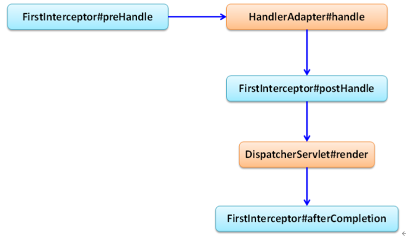  

## 多个拦截器案例
- 创建拦截器实现类，在SpringMVC核心配置文件内进行注册：
```xml
<mvc:interceptors>
    <!--使用bean标签配置 默认拦截所有请求-->
    <!--<bean class="com.ralife.interceptor.FirstInterceptor"></bean>
    <bean class="com.ralife.interceptor.SecondInterceptor"></bean>-->
    <mvc:interceptor>
        <mvc:mapping path="/inter/hello"/>
        <bean class="com.ralife.interceptor.SecondInterceptor"></bean>
    </mvc:interceptor>
    <mvc:interceptor>
        <mvc:mapping path="/inter/hello"/>
        <bean class="com.ralife.interceptor.FirstInterceptor"></bean>
    </mvc:interceptor>
</mvc:interceptors>
```  
- 多个拦截器方法执行顺序：
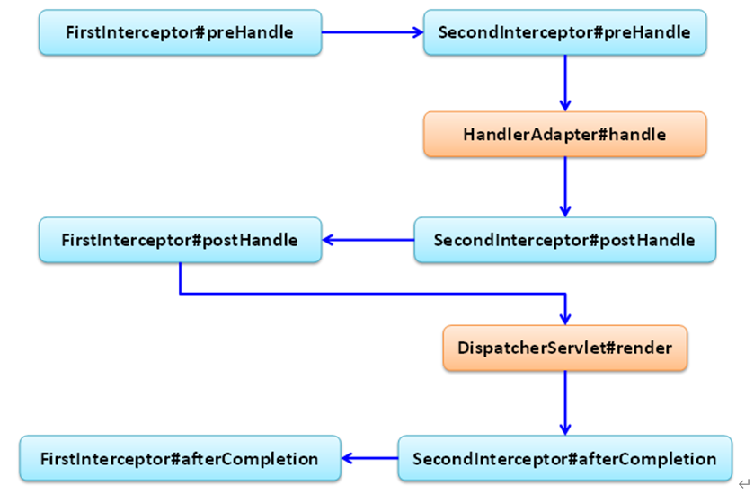    

- 只要有一个拦截器的preHandle()返回false，就不会执行控制器中的方法：  
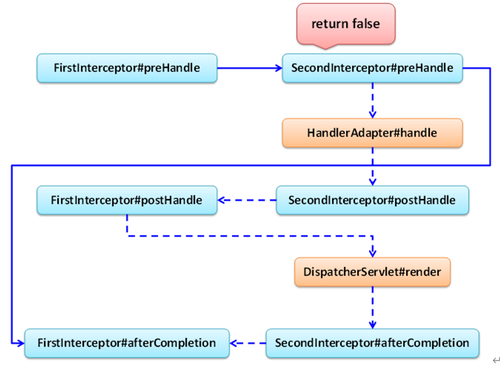   
# SpringMVC 异常处理
- Spring MVC 通过 **HandlerExceptionResolver** 处理程序的异常，包括 Handler 映射、数据绑定以及目标方法执行时发生的异常。

- DispatcherServlet  默认装配的 HandlerExceptionResolver ：
  
  - 没有使用 `<mvc:annotation-driven/>`配置：
    AnnotationMethodHandlerExceptionResolver  
    ResponseStatusExceptionResolver
    DefaultHandlerExceptionResolver

  - 使用 `<mvc:annotation-driven/>`配置：   
    ExceptionHandlerExceptionResolver  
    ResponseStatusExceptionResolver
    DefaultHandlerExceptionResolver
## ExceptionHandlerExceptionResolver（@ExceptionHandler）
### 在控制器异常处理方法上添加@ExceptionHandler  
```java
/**
* 通过value属性指定可以处理的异常类型。
* 如果需要将异常详细信息返回到前端页面，可以在方法中传入Exception对象  通过ModelAndView返回异常信息。
* 如果存在多个异常处理方法，异常越精确执行的优先级越高
* @return
*/
@ExceptionHandler(value = {ArithmeticException.class,NullPointerException.class})
public ModelAndView handleException(Exception ex){
    ModelAndView mav = new ModelAndView();
    mav.setViewName("error");
    mav.addObject("errorInfo",ex.getMessage());
    return mav;
}
```
### 在 自定义公共异常处理类 方法上添加@ExceptionHandler  
```java
@ControllerAdvice //使用该注解标识此类是用作全局异常的处理类
public class GrobleException {

    @ExceptionHandler
    public ModelAndView handleAritcleException(ArithmeticException e){
        ModelAndView mav = new ModelAndView();
        mav.setViewName("error");
        mav.addObject("errorInfo",e.getMessage());
        return mav;
    }
}
```
### 异常执行顺序问题
- 控制器中存在多个异常处理的方法，异常越精确优先级越高；

- 控制器异常处理方法比自定义异常处理类优先级更高，即使自定义异常类中的处理的异常更精确也是如此；

- 只要存在@ExceptionHandler标注的自定义异常处理方法，就不会再执行其它异常解析器。
## ResponseStatusExceptionResolver（@ResponseStatus）
- @ResponseStatus 通常用来标注到自定义异常类上，优先级比@ExceptionHandler低。（常用reason和HttpStatus两个属性）
```java
@ResponseStatus(value=HttpStatus.FORBIDDEN,reason="用户名称和密码不匹配")
public class UsernameNotMatchPasswordException extends RuntimeException{}

@RequestMapping(value="/testResponseStatusExceptionResolver")
public String testResponseStatusExceptionResolver(@RequestParam("i") int i){
if(i==13){
throw new UsernameNotMatchPasswordException();
}
return "success";
}
```  
- 如果在控制器方法上也加上@ResponseStatus注解，则会覆盖自定义异常类上的@ResponseStatus注解。
## DefaultHandlerExceptionResolver（判断是否SpringMVC自带的异常）
优先级最低，如果SpringMVC自带的异常没人处理，这个默认的异常解析器才会起作用。

## SimpleMappingExceptionResolver（通过配置的方式实现异常处理）
```xml
<!--配置方式实现异常处理-->
<bean id="exceptionResolver" class="org.springframework.web.servlet.handler.SimpleMappingExceptionResolver">
    <!--配置异常对象信息，可省略，默认保存到exception对象中-->
    <property name="exceptionAttribute" value="exception"></property>
    <!--自定义异常映射 prop:key 指定具体的异常类型 prop:value 指定视图名-->
    <property name="exceptionMappings">
        <props>
            <prop key="java.lang.ArithmeticException">error</prop>
        </props>
    </property>
</bean>
```
# SpringMVC 运行流程
- 前端控制器(DispatcherServlet)接收请求，调用doDispatch进行处理；  

- 根据HandlerMapping中保存的请求映射信息找到处理当前请求的处理器执行链（包含拦截器）； 

- 根据当前处理器找到它的HandlerAdapter（适配器）；

- 拦截器的preHandle先执行；

- 设配器执行目标方法，并返回ModelAndView：
  
  - ModelAttribute注解标注的方法提前运行  

  - 执行目标方法的时候（确定目标方法用的参数）  

- 执行拦截器的postHandle方法

- 通过视图解析器进行页面渲染  
  
  - 如果有异常使用异常解析器处理异常；处理完后还会返回ModelAndView对象  
  
  - 调用render进行页面渲染
  
    - 视图解析器根据视图名得到视图对象  

    - 视图对象调用render方法
  
  - 执行拦截器的afterCompletion方法  
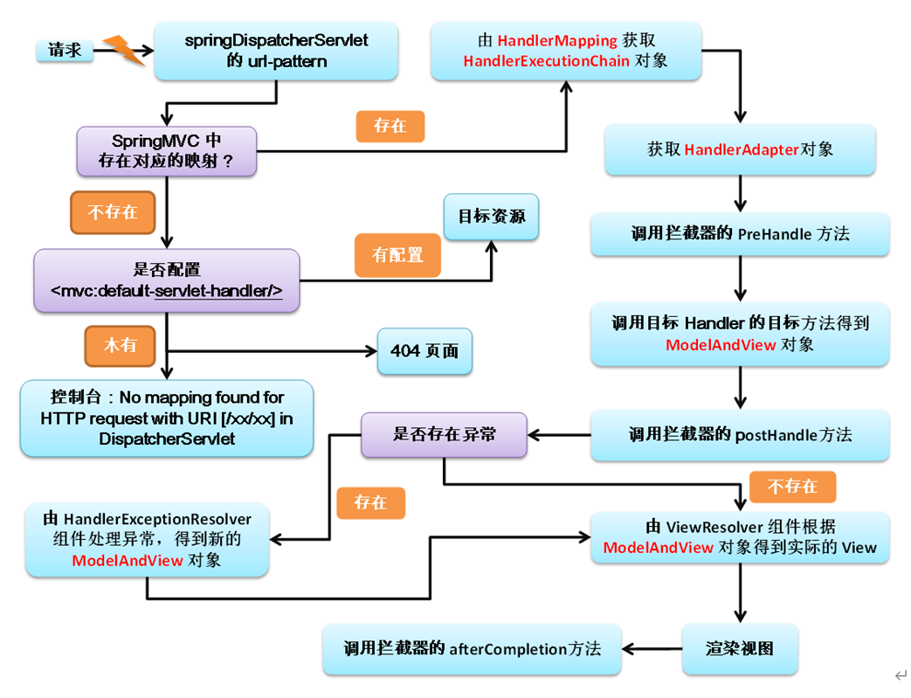
# Spring整合SpringMVC  
- 通常情况下, 类似于数据源, 事务, service，dao，整合其他框架都是放在 Spring 的配置文件中；

- 只有web相关处理（控制层）放在 Springmvc 的配置文件中；  

- 多个 Spring IOC 容器之间可以设置为父子关系，以实现良好的解耦；默认情况下spring配置文件是springmvc配置文件的父类。**子类可以使用父类中的容器，但父类不能使用子类的**。  

## SSM整合流程  
- 第一步：web.xml配置监听器
```xml
<context-param>
	<param-name>contextConfigLocation</param-name>
	<param-value>classpath:beans.xml</param-value>
</context-param>
<listener>
    <listener-class>org.springframework.web.context.ContextLoaderListener</listener-class>
</listener>
```
- 第二步：spring核心配置文件(beans.xml)设置组件扫描（扫除控制层之外的）
```xml
<context:component-scan base-package="com.ralife">
<context:exclude-filter type="annotation"
        expression="org.springframework.stereotype.Controller"/>
<context:exclude-filter type="annotation"
        expression="org.springframework.web.bind.annotation.ControllerAdvice"/>
</context:component-scan>

```
- 第三步：springmvc核心配置文件(springmvc.xml)设置组件扫描(只扫控制层的)
```xml
<context:component-scan base-package="com.ralife" use-default-filters="false">
<context:include-filter type="annotation"
           expression="org.springframework.stereotype.Controller"/>
<context:include-filter type="annotation"
           expression="org.springframework.web.bind.annotation.ControllerAdvice"/>
</context:component-scan>

```
# IDEA控制台中文乱码  
[IDEA控制台乱码](https://blog.csdn.net/lin_dark/article/details/99132548)
